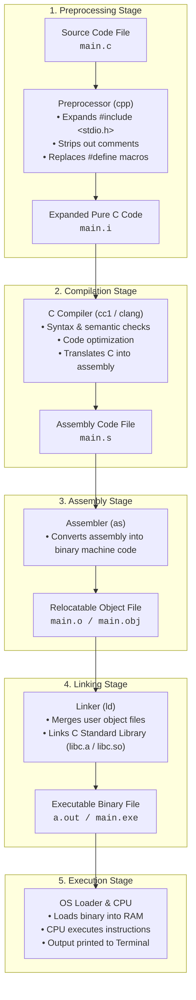

# CHAPTER 1 : INTRODUCTION TO C PROGRAMMING

[](https://en.cppreference.com/w/c)
[](https://gcc.gnu.org/)
[](https://code.visualstudio.com/)
[](https://git-scm.com/)
[](https://github.com/)
[](LICENSE)

> A comprehensive, beginner-friendly introduction to the C programming language — often called the "Mother of all Programming Languages." Learn why C is foundational, explore the compilation lifecycle, and master the anatomy of your very first C program.

---

## Course Roadmap

This course is organized into **12 core chapters** followed by **hands-on mini projects** at the end:

| S.No | Chapter / Topic | Key Focus Areas |
| :--- | :--- | :--- |
| **Chapter 1** | **Introduction to C Programming** | History, Compilation Lifecycle, Syntax & `printf` |
| **Chapter 2** | Variables / Data Types | `int`, `float`, `char`, Format Specifiers & Constants |
| **Chapter 3** | Instructions & Operators | Arithmetic, Relational, Logical & Type Casting |
| **Chapter 4** | Conditional Statements | `if`, `else-if`, `else`, Ternary Operator & `switch` |
| **Chapter 5** | Loop Control Statements | `for`, `while`, `do-while`, `break` & `continue` |
| **Chapter 6** | Functions & Recursion | Modular Programming, Scope, Call by Value & Recursion |
| **Chapter 7** | Pointers | Memory Addresses, Dereferencing & Pointer Arithmetic |
| **Chapter 8** | Arrays | 1D Arrays, 2D Matrices & Multidimensional Storage |
| **Chapter 9** | Strings | Character Arrays, `<string.h>` Library Functions & I/O |
| **Chapter 10** | Structures | User-Defined Data Types, Unions & Typedef |
| **Chapter 11** | File I/O | Reading, Writing, Appending & File Pointers (`FILE*`) |
| **Chapter 12** | Dynamic Memory | `malloc()`, `calloc()`, `realloc()` & `free()` |
| **Bonus** | **Hands-on Mini Projects** | Real-world CLI Tools, Games & System Utilities |

---

## Why Learn C?

C was developed by **Dennis Ritchie** at Bell Labs between 1972 and 1973. Decades later, it remains one of the most widely used and influential languages in computer science.

- **Direct Hardware & Memory Control**: C gives you close-to-the-metal access using pointers and direct memory addressing.
- **Blazing Fast Performance**: C compiles directly to native machine code with zero runtime overhead or garbage collection pauses.
- **Foundational Architecture**: Operating systems (Linux, Windows, macOS kernels), databases (MySQL, PostgreSQL), and language runtimes (Python, Node.js V8) are written in C/C++.
- **Stepping Stone**: Mastering C makes learning C++, Java, Rust, and Python significantly easier because you already understand what happens under the hood.

---

## How C Programs Run: Complete Compilation Pipeline

Unlike interpreted languages that run line-by-line, C code goes through four deep transformation stages before the CPU can execute it:



---

## Your First C Program: Hello World

```c
#include <stdio.h>

int main() {
    printf("Hello, World!\n");
    return 0;
}
```

### Detailed Line-by-Line Breakdown

| Code Snippet | Purpose | Explanation |
| :--- | :--- | :--- |
| `#include <stdio.h>` | Preprocessor Directive | Loads the **Standard Input/Output** header file containing definitions for `printf()` and `scanf()`. |
| `int main()` | Main Function Entrypoint | The starting point of every C program. The operating system calls `main()` first. `int` denotes that this function returns an integer status code. |
| `{ ... }` | Code Block / Scope | Curly braces enclose the body of the function. |
| `printf("Hello, World!\n");` | Built-in Output Function | Prints the string to the terminal console. `\n` represents an escape sequence for a new line. |
| `;` | Statement Terminator | Every individual instruction in C must end with a semicolon. |
| `return 0;` | Exit Status Code | Returns `0` to the operating system, signaling that the program executed successfully without runtime errors. |

---

## Basic Comments in C

Comments are ignored by the compiler and are used to document code for humans:

```c
// Single-line comment: explains the next line of code

/*
   Multi-line comment:
   Useful for writing detailed explanations,
   algorithm designs, or temporarily disabling blocks of code.
*/
```

---

## Compiling and Running C Programs

### 1. Using GCC (GNU Compiler Collection)

Open your terminal and navigate to the directory containing your `.c` file:

```bash
# Step 1: Compile source code into an executable named 'hello'
gcc main.c -o hello

# Step 2: Run the executable
# On macOS / Linux:
./hello

# On Windows (Command Prompt / PowerShell):
hello.exe
```

### 2. Using Clang

```bash
clang main.c -o hello
./hello
```

### 3. One-Liner (Compile & Run)

```bash
gcc main.c -o hello && ./hello
```

---

## Practice Problems (WAP - Write A Program)

### Problem 1: Personal Introduction
Write a C program to display your name, college/organization, and goal in programming on separate lines.

```c
#include <stdio.h>

int main() {
    printf("Name: Adesh Srivastava\n");
    printf("Learning: C Programming from Basics to Advanced\n");
    printf("Goal: Master Low-Level Systems and Memory Management!\n");
    return 0;
}
```

### Problem 2: Printing Formatted Patterns
Write a C program using multiple `printf()` statements to print a neat ASCII triangle pattern.

```c
#include <stdio.h>

int main() {
    printf("   *   \n");
    printf("  ***  \n");
    printf(" ***** \n");
    printf("*******\n");
    return 0;
}
```

---

## Key Takeaways from Chapter 1

1. C is case-sensitive (`Main` is different from `main`).
2. Execution strictly begins and ends with the `main()` function.
3. Header files (`.h`) provide pre-built functions for standard I/O, math, strings, and memory.
4. Semicolons `;` are mandatory statement terminators in C.
5. Returning `0` from `main()` represents successful program execution.

---

## License

This project is licensed under the [MIT License](LICENSE).

---

<div>

**Made with ❤️ for Beginners** • **Author : Adesh Srivastava (Tanmay)**

</div>