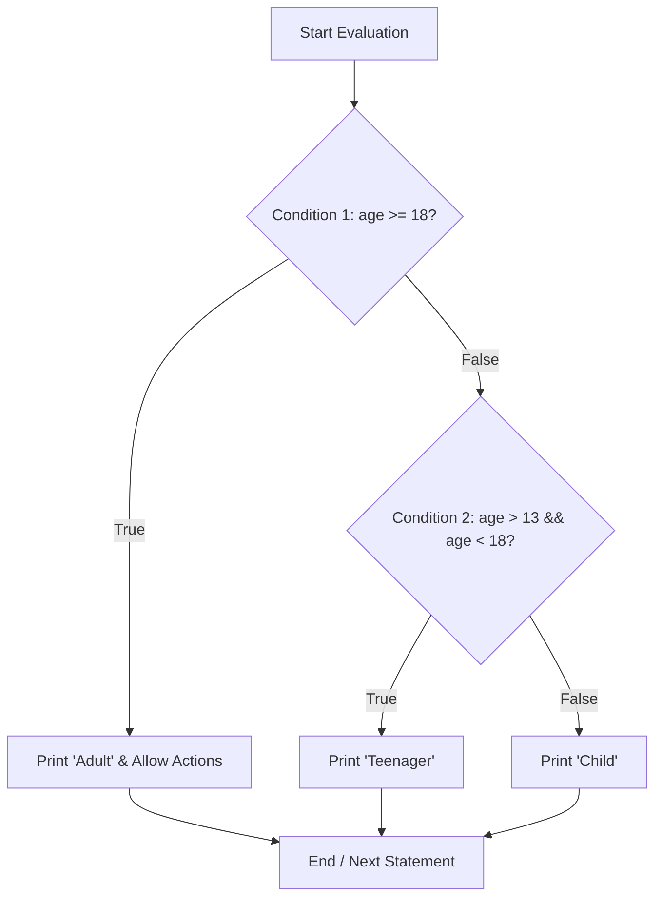

# CHAPTER 4 : CONDITIONAL STATEMENT

[](https://en.cppreference.com/w/c)
[](https://gcc.gnu.org/)
[](https://code.visualstudio.com/)
[](https://git-scm.com/)
[](LICENSE)

> Master decision-making logic in C — exploring `if-else` statements, the `else-if` ladder, the compact Ternary Operator (`?:`), `switch-case` constructs, nested conditions, and algorithmic problem-solving like Armstrong number verification.

---

## Table of Contents

- [What is a Conditional Statement?](#what-is-a-conditional-statement)
- [The if-else Statement](#the-if-else-statement)
- [The else-if Ladder](#the-else-if-ladder)
- [Ternary Operator](#ternary-operator)
- [The switch-case Statement](#the-switch-case-statement)
- [Nested Conditionals](#nested-conditionals)
- [Decision Flowchart](#decision-flowchart)
- [Practice Problems and Solutions](#practice-problems-and-solutions)
- [License](#license)

---

## What is a Conditional Statement?

A **conditional statement** allows a program to make decisions by executing different blocks of code depending on whether a given condition evaluates to **True** (non-zero) or **False** (`0`).

```text
Types of Conditional Statements in C:
1. if-else Statements
2. else-if Ladders (Multi-way branching)
3. Ternary Operator (?:)
4. switch-case Statements
5. Nested Conditions
```

---

## The if-else Statement

Executes the `if` block if the condition is True; otherwise, executes the `else` block:

```c
#include <stdio.h>

int main() {
    int age;
    printf("Enter your age: ");
    scanf("%d", &age);

    if (age >= 18) {
        printf("Adult\n");
        printf("You are eligible to vote and drive.\n");
    } else {
        printf("Minor\n");
        printf("You are not eligible to vote or drive.\n");
    }

    printf("Thank you!\n");
    return 0;
}
```

---

## The else-if Ladder

When multiple conditions need to be evaluated sequentially:

```c
#include <stdio.h>

int main() {
    int age;
    printf("Enter your age: ");
    scanf("%d", &age);

    if (age >= 18) {
        printf("Adult\n");
    } else if (age > 13 && age < 18) {
        printf("Teenager\n");
    } else {
        printf("Child\n");
    }

    return 0;
}
```

---

## Ternary Operator

The **Ternary Operator (`?:`)** provides a concise, one-line alternative to simple `if-else` blocks:

$$\text{Condition} \ ? \ \text{Expression if True} \ : \ \text{Expression if False};$$

```c
#include <stdio.h>

int main() {
    int age;
    printf("Enter your age: ");
    scanf("%d", &age);

    // Compact one-line decision
    age >= 18 ? printf("Adult\n") : printf("Not Adult\n");

    return 0;
}
```

---

## The switch-case Statement

The `switch` statement selects one of many code blocks to be executed based on the evaluation of an **integer or character expression**:

```c
#include <stdio.h>

int main() {
    int day;
    printf("Enter day number (1-7): ");
    scanf("%d", &day);

    switch (day) {
        case 1:
            printf("Monday\n");
            break;
        case 2:
            printf("Tuesday\n");
            break;
        case 3:
            printf("Wednesday\n");
            break;
        case 4:
            printf("Thursday\n");
            break;
        case 5:
            printf("Friday\n");
            break;
        case 6:
            printf("Saturday\n");
            break;
        case 7:
            printf("Sunday\n");
            break;
        default:
            printf("Invalid day! Please enter 1-7.\n");
    }

    return 0;
}
```

### Key Rules of `switch-case`:
- **`break` Keyword**: Terminates the switch statement. Without `break`, execution falls through to subsequent cases (**Fall-through**).
- **Constant Expressions**: Case labels must be integer or character constants (e.g. `case 1:` or `case 'A':`). Floats/strings are not permitted.
- **`default` Case**: Runs when none of the explicit case values match. It is optional and can be placed anywhere.
- **Order Flexibility**: Cases do not need to be in ascending or sequential order.

---

## Nested Conditionals

An `if` statement can contain another `if` or `switch` inside it:

```c
#include <stdio.h>

int main() {
    int number;
    printf("Enter a number: ");
    scanf("%d", &number);

    if (number >= 0) {
        printf("Positive\n");
        if (number % 2 == 0) {
            printf("Even Number\n");
        } else {
            printf("Odd Number\n");
        }
    } else {
        printf("Negative Number\n");
    }

    return 0;
}
```

---

## Decision Flowchart



---

## Practice Problems and Solutions

### Problem 1: Pass or Fail Checker
Write a C program to check whether a student passed or failed (Marks $> 30$ is PASS, $\le 30$ is FAIL).

```c
#include <stdio.h>

int main() {
    int marks;
    printf("Enter marks (0-100): ");
    scanf("%d", &marks);

    if (marks > 30) {
        printf("Status: PASS\n");
    } else {
        printf("Status: FAIL\n");
    }

    return 0;
}
```

---

### Problem 2: Student Grading System
Write a C program to calculate grades based on marks:
- $\text{Marks} < 30 \rightarrow \text{Grade C}$
- $30 \le \text{Marks} < 70 \rightarrow \text{Grade B}$
- $70 \le \text{Marks} < 90 \rightarrow \text{Grade A}$
- $90 \le \text{Marks} \le 100 \rightarrow \text{Grade A+}$

```c
#include <stdio.h>

int main() {
    int marks;
    printf("Enter marks (0-100): ");
    scanf("%d", &marks);

    if (marks < 30) {
        printf("Grade: C\n");
    } else if (marks >= 30 && marks < 70) {
        printf("Grade: B\n");
    } else if (marks >= 70 && marks < 90) {
        printf("Grade: A\n");
    } else if (marks >= 90 && marks <= 100) {
        printf("Grade: A+\n");
    } else {
        printf("Invalid marks entered!\n");
    }

    return 0;
}
```

---

### Problem 3: Uppercase vs Lowercase Character Checker
Write a C program to determine whether an entered character is uppercase, lowercase, or a non-alphabetic character.

```c
#include <stdio.h>

int main() {
    char ch;
    printf("Enter a character: ");
    scanf(" %c", &ch);

    if (ch >= 'A' && ch <= 'Z') {
        printf("'%c' is an UPPERCASE letter.\n", ch);
    } else if (ch >= 'a' && ch <= 'z') {
        printf("'%c' is a LOWERCASE letter.\n", ch);
    } else {
        printf("'%c' is not an alphabetic letter.\n", ch);
    }

    return 0;
}
```

---

### Problem 4: Armstrong Number Checker (Star Question)
An **Armstrong number** of $n$ digits is an integer such that the sum of its digits raised to the power $n$ equals the number itself (e.g. $153 = 1^3 + 5^3 + 3^3 = 1 + 125 + 27 = 153$).

```c
#include <stdio.h>
#include <math.h>

int main() {
    int num, originalNum, remainder, sum = 0, digitCount = 0;

    printf("Enter an integer: ");
    scanf("%d", &num);

    originalNum = num;

    // Step 1: Count number of digits
    int temp = num;
    while (temp != 0) {
        digitCount++;
        temp /= 10;
    }

    // Step 2: Compute sum of powers of digits
    temp = num;
    while (temp != 0) {
        remainder = temp % 10;
        sum += pow(remainder, digitCount);
        temp /= 10;
    }

    // Step 3: Check condition
    if (sum == originalNum) {
        printf("%d is an Armstrong Number!\n", originalNum);
    } else {
        printf("%d is NOT an Armstrong Number.\n", originalNum);
    }

    return 0;
}
```

---

### Problem 5: Natural Number Checker
Write a C program to check whether an integer is a natural number (Natural numbers start from $1, 2, 3, \dots$).

```c
#include <stdio.h>

int main() {
    int num;
    printf("Enter a number: ");
    scanf("%d", &num);

    if (num >= 1) {
        printf("%d is a Natural Number.\n", num);
    } else {
        printf("%d is NOT a Natural Number.\n", num);
    }

    return 0;
}
```

---

## License

This project is licensed under the [MIT License](LICENSE).

---

**Made with ❤️ for Beginners** • **Author: Adesh Srivastava (Tanmay)**
```
