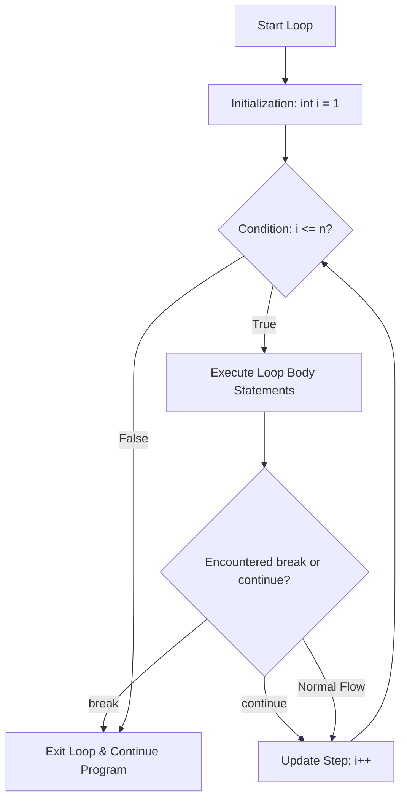

# CHAPTER 5 : LOOPS CONTROL STATEMENT

[](https://en.cppreference.com/w/c)
[](https://gcc.gnu.org/)
[](https://code.visualstudio.com/)
[](https://git-scm.com/)
[](LICENSE)

> Master repetitive execution in C — understanding the anatomy of loops, `for`, `while`, and `do-while` structures, pre/post increment operators, `break` and `continue` control flow, nested loops, and 14 comprehensive practice problems including prime numbers and factorials.

---

## Table of Contents

- [What is a Loop?](#what-is-a-loop)
- [The Anatomy of a Loop](#the-anatomy-of-a-loop)
- [Loop Types Comparison](#loop-types-comparison)
- [1. The for Loop](#1-the-for-loop)
- [2. The while Loop](#2-the-while-loop)
- [3. The do-while Loop](#3-the-do-while-loop)
- [Pre vs Post Increment and Decrement](#pre-vs-post-increment-and-decrement)
- [Loop Control Statements (break and continue)](#loop-control-statements-break-and-continue)
- [Nested Loops](#nested-loops)
- [Loop Execution Flowchart](#loop-execution-flowchart)
- [Practice Problems and Solutions](#practice-problems-and-solutions)
- [License](#license)

---

## What is a Loop?

A **loop** is a control flow structure that repeatedly executes a block of code as long as a specified condition evaluates to **True**.

Instead of manually duplicating code, loops automate repetitive calculations, list traversals, and algorithms, terminating automatically as soon as the test condition becomes **False**.

---

## The Anatomy of a Loop

Every standard loop consists of three core components:

```text
┌─────────────────────────────────────────────────────────────┐
│                    Three Pillars of a Loop                  │
├───────────────────┬─────────────────────────────────────────┤
│ 1. Initialization │ Sets the starting value (e.g. int i = 0)│
│ 2. Condition      │ Test evaluated before/after iteration   │
│ 3. Update Step    │ Modifies counter (i++ or i--) per cycle │
└───────────────────┴─────────────────────────────────────────┘
```

---

## Loop Types Comparison

| Feature | `for` Loop | `while` Loop | `do-while` Loop |
| :--- | :--- | :--- | :--- |
| **Control Type** | Entry-controlled | Entry-controlled | Exit-controlled |
| **Condition Check** | Before loop body | Before loop body | After loop body |
| **Minimum Executions** | `0` times | `0` times | **`1` time guaranteed** |
| **Best Used When** | Iteration count is known | Iteration count is unknown | Menu/input prompt needed first |

---

## 1. The for Loop

Condenses initialization, condition testing, and increment/decrement into a single line:

```c
#include <stdio.h>

int main() {
    // Prints 1 to 5
    for (int i = 1; i <= 5; i++) {
        printf("Iteration: %d\n", i);
    }
    return 0;
}
```

### Flexible Counter Types:
Loop counters in C are not limited to integers — floats and characters are fully valid:

```c
// Float counter
for (float f = 1.0; f <= 3.0; f += 0.5) {
    printf("%.1f ", f);
}

// Character counter
for (char ch = 'a'; ch <= 'z'; ch++) {
    printf("%c ", ch);
}
```

---

## 2. The while Loop

Repeats code as long as the condition remains true. Best for indefinite loops:

```c
#include <stdio.h>

int main() {
    int i = 1;
    while (i <= 5) {
        printf("Count: %d\n", i);
        i++;
    }
    return 0;
}
```

---

## 3. The do-while Loop

Executes the code block first, and evaluates the condition at the end:

```c
#include <stdio.h>

int main() {
    int i = 1;
    do {
        printf("Number: %d\n", i);
        i++;
    } while (i <= 5);
    return 0;
}
```

---

## Pre vs Post Increment and Decrement

| Operator | Syntax | Description | Example (`i = 1`) | Result |
| :--- | :---: | :--- | :--- | :---: |
| **Post-Increment** | `i++` | Uses current value, then increments | `int a = i++;` | `a = 1, i = 2` |
| **Pre-Increment** | `++i` | Increments first, then uses new value | `int a = ++i;` | `a = 2, i = 2` |
| **Post-Decrement** | `i--` | Uses current value, then decrements | `int a = i--;` | `a = 1, i = 0` |
| **Pre-Decrement** | `--i` | Decrements first, then uses new value | `int a = --i;` | `a = 0, i = 0` |

---

## Loop Control Statements (break and continue)

### 1. The `break` Statement
Instantly terminates the loop and jumps to the code following the loop:

```c
for (int i = 1; i <= 5; i++) {
    if (i == 3) {
        break; // Stops loop completely when i reaches 3
    }
    printf("%d ", i); // Output: 1 2
}
```

### 2. The `continue` Statement
Skips the remainder of the current iteration and jumps directly to the update/condition step:

```c
for (int i = 1; i <= 5; i++) {
    if (i == 3) {
        continue; // Skips printing 3
    }
    printf("%d ", i); // Output: 1 2 4 5
}
```

---

## Nested Loops

A **nested loop** is a loop placed inside the body of another loop. The inner loop executes completely for every single iteration of the outer loop:

```c
#include <stdio.h>

int main() {
    // 4 rows and 5 columns
    for (int row = 0; row < 4; row++) {
        for (int col = 0; col < 5; col++) {
            printf("*");
        }
        printf("\n");
    }
    return 0;
}
```

---

## Loop Execution Flowchart



---

## Practice Problems and Solutions

### Problem 1: Print Numbers 0 to 10
Write a C program to print numbers from 0 to 10 using a `for` loop.

```c
#include <stdio.h>

int main() {
    for (int i = 0; i <= 10; i++) {
        printf("%d\n", i);
    }
    return 0;
}
```

---

### Problem 2: Print Numbers 0 to N
Write a C program to print numbers from 0 to $N$ using both `while` and `for` loops.

```c
#include <stdio.h>

int main() {
    int n;
    printf("Enter N: ");
    scanf("%d", &n);

    // Using while loop
    printf("Using while loop:\n");
    int i = 0;
    while (i <= n) {
        printf("%d ", i);
        i++;
    }

    // Using for loop
    printf("\nUsing for loop:\n");
    for (int j = 0; j <= n; j++) {
        printf("%d ", j);
    }
    printf("\n");

    return 0;
}
```

---

### Problem 3: Sum of First N Natural Numbers & Reverse Output
Write a C program to compute the sum of the first $N$ natural numbers and display them in reverse order.

```c
#include <stdio.h>

int main() {
    int n, sum = 0;
    printf("Enter N: ");
    scanf("%d", &n);

    for (int i = 1; i <= n; i++) {
        sum += i;
    }
    printf("Sum of first %d natural numbers: %d\n", n, sum);

    printf("Numbers in reverse: ");
    for (int i = n; i >= 1; i--) {
        printf("%d ", i);
    }
    printf("\n");

    return 0;
}
```

---

### Problem 4: Multiplication Table of N
Write a C program to print the multiplication table of an integer $N$ from 1 to 10.

```c
#include <stdio.h>

int main() {
    int n;
    printf("Enter a number: ");
    scanf("%d", &n);

    printf("--- Multiplication Table for %d ---\n", n);
    for (int i = 1; i <= 10; i++) {
        printf("%d x %2d = %d\n", n, i, n * i);
    }

    return 0;
}
```

---

### Problem 5: Keep Reading Input Until an Odd Number is Entered

```c
#include <stdio.h>

int main() {
    int n;
    do {
        printf("Enter an integer: ");
        scanf("%d", &n);
        printf("You entered: %d\n", n);

        if (n % 2 != 0) {
            printf("Odd number detected! Exiting...\n");
            break;
        }
    } while (1);

    return 0;
}
```

---

### Problem 6: Keep Reading Input Until a Multiple of 7 is Entered

```c
#include <stdio.h>

int main() {
    int n;
    do {
        printf("Enter an integer: ");
        scanf("%d", &n);
        printf("You entered: %d\n", n);

        if (n % 7 == 0) {
            printf("Multiple of 7 detected! Exiting...\n");
            break;
        }
    } while (1);

    return 0;
}
```

---

### Problem 7: Print Numbers 1 to 10 Except 6

```c
#include <stdio.h>

int main() {
    for (int i = 1; i <= 10; i++) {
        if (i == 6) {
            continue; // Skip 6
        }
        printf("%d ", i);
    }
    printf("\n");
    return 0;
}
```

---

### Problem 8: Print All Odd Numbers from 5 to 50

```c
#include <stdio.h>

int main() {
    printf("Odd numbers from 5 to 50:\n");
    for (int i = 5; i <= 50; i++) {
        if (i % 2 != 0) {
            printf("%d ", i);
        }
    }
    printf("\n");
    return 0;
}
```

---

### Problem 9: Factorial of a Number N ($N!$)

```c
#include <stdio.h>

int main() {
    int n;
    long long fact = 1;

    printf("Enter a positive integer: ");
    scanf("%d", &n);

    for (int i = 1; i <= n; i++) {
        fact *= i;
    }

    printf("Factorial of %d is: %lld\n", n, fact);
    return 0;
}
```

---

### Problem 10: Reverse Multiplication Table of N

```c
#include <stdio.h>

int main() {
    int n;
    printf("Enter number: ");
    scanf("%d", &n);

    printf("--- Reverse Multiplication Table for %d ---\n", n);
    for (int i = 10; i >= 1; i--) {
        printf("%d x %2d = %d\n", n, i, n * i);
    }

    return 0;
}
```

---

### Problem 11: Sum of Numbers Between 5 and 50 (Inclusive)

```c
#include <stdio.h>

int main() {
    int sum = 0;
    for (int i = 5; i <= 50; i++) {
        sum += i;
    }
    printf("Sum from 5 to 50 is: %d\n", sum);
    return 0;
}
```

---

### Problem 12: Print 4x5 Solid Asterisk Pattern (Nested Loops)

```c
#include <stdio.h>

int main() {
    for (int i = 0; i < 4; i++) {
        for (int j = 0; j < 5; j++) {
            printf("*");
        }
        printf("\n");
    }
    return 0;
}
```

---

### Problem 13: Check if a Number is Prime
Write a C program to check whether a given integer $N$ is prime or composite.

```c
#include <stdio.h>

int main() {
    int num, isPrime = 1;

    printf("Enter a number: ");
    scanf("%d", &num);

    if (num <= 1) {
        printf("%d is NOT a prime number.\n", num);
        return 0;
    }

    for (int i = 2; i * i <= num; i++) {
        if (num % i == 0) {
            isPrime = 0;
            break;
        }
    }

    if (isPrime) {
        printf("%d is a PRIME number.\n", num);
    } else {
        printf("%d is NOT a prime number.\n", num);
    }

    return 0;
}
```

---

### Problem 14: Print All Prime Numbers in a Range

```c
#include <stdio.h>

int main() {
    int start, end;

    printf("Enter start range: ");
    scanf("%d", &start);

    printf("Enter end range: ");
    scanf("%d", &end);

    printf("Prime numbers between %d and %d are:\n", start, end);

    for (int num = start; num <= end; num++) {
        if (num <= 1) continue;

        int isPrime = 1;
        for (int i = 2; i * i <= num; i++) {
            if (num % i == 0) {
                isPrime = 0;
                break;
            }
        }

        if (isPrime) {
            printf("%d ", num);
        }
    }
    printf("\n");

    return 0;
}
```

---

## License

This project is licensed under the [MIT License](LICENSE).

---

**Made with ❤️ for Beginners** • **Author: Adesh Srivastava (Tanmay)**
```
