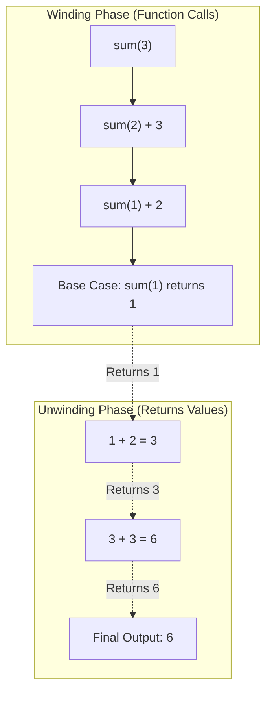

# CHAPTER 6 : FUNCTIONS & RECURSIONS

[](https://en.cppreference.com/w/c)
[](https://gcc.gnu.org/)
[](https://code.visualstudio.com/)
[](https://git-scm.com/)
[](LICENSE)

> Master modular programming and recursive divide-and-conquer problem solving in C — exploring function prototypes, definitions, calls, Call by Value, base cases, call stacks, stack overflow prevention, and 14 comprehensive practice problems.

---

## Table of Contents

- [What is a Function?](#what-is-a-function)
- [The 3 Stages of a Function](#the-3-stages-of-a-function)
- [Types of Functions in C](#types-of-functions-in-c)
- [Arguments vs Parameters](#arguments-vs-parameters)
- [Call by Value (Pass by Value)](#call-by-value-pass-by-value)
- [What is Recursion?](#what-is-recursion)
- [The Two Core Rules of Recursion](#the-two-core-rules-of-recursion)
- [Normal Function Call vs Recursive Call](#normal-function-call-vs-recursive-call)
- [Recursion vs Iteration](#recursion-vs-iteration)
- [Recursion Call Stack Workflow](#recursion-call-stack-workflow)
- [Practice Problems and Solutions](#practice-problems-and-solutions)
- [License](#license)

---

## What is a Function?

A **function** is a self-contained, reusable block of code designed to perform a specific task:

```text
Input (Arguments) ───► [ FUNCTION BLOCK ] ───► Output (Return Value)
```

### Why Use Functions?
1. **Reusability**: Write code once, execute it multiple times without duplicating logic.
2. **Modularity**: Break large, complex codebases into smaller, logical, testable units.
3. **Maintainability**: Fix bugs or update algorithms in one central location.

---

## The 3 Stages of a Function

Every function in C follows three distinct stages:

```text
┌─────────────────────────────────────────────────────────────┐
│                 Three Stages of a Function                  │
├────────────────────┬────────────────────────────────────────┤
│ 1. Prototype       │ void printHello();    (Tell Compiler)  │
│ 2. Definition      │ void printHello() {..}(Do the Work)    │
│ 3. Function Call   │ printHello();         (Use the Work)   │
└────────────────────┴────────────────────────────────────────┘
```

### Syntax and Implementation:

```c
#include <stdio.h>

// 1. Prototype (Declaration): Tells compiler name, return type & parameters
void printHello();

int main() {
    // 3. Function Call: Executes the function
    printHello();
    printHello();
    return 0;
}

// 2. Definition: Contains the actual logic to be executed
void printHello() {
    printf("Hello! Practice code daily.\n");
}
```

---

## Types of Functions in C

| Category | Description | Examples |
| :--- | :--- | :--- |
| **Library Functions** | Standard built-in functions bundled with C header files. | `printf()`, `scanf()`, `pow()`, `sqrt()`, `strcmp()` |
| **User-Defined Functions** | Custom functions declared, defined, and customized by the programmer. | `sum()`, `calculatePrice()`, `factorial()`, `fib()` |

---

## Arguments vs Parameters

| Feature | Arguments (Actual Parameters) | Parameters (Formal Parameters) |
| :--- | :--- | :--- |
| **Definition** | The real values passed to the function during a function call. | The placeholder variables defined inside the function signature. |
| **Location** | Inside caller (`main()`). | Inside function definition header. |
| **Purpose** | Used to **send** values. | Used to **receive** values. |
| **Example** | `sum(a, b);` $\rightarrow$ `a, b` are arguments. | `int sum(int x, int y)` $\rightarrow$ `x, y` are parameters. |

---

## Call by Value (Pass by Value)

In C, arguments are passed **by value**. A distinct copy of the variable's value is created in memory for the function:

- Modifications made to formal parameters inside the function **do not change** the original variable in the caller.
- Functions can only return **one value** at a time using the `return` statement.

```c
#include <stdio.h>

void calculatePrice(float value) {
    value = value + (0.18 * value); // Modifies local copy only
    printf("Price with 18%% GST (inside function): %.2f\n", value);
}

int main() {
    float value = 100.0;
    calculatePrice(value);
    printf("Original price in main: %.2f\n", value); // Remains 100.00
    return 0;
}
```

---

## What is Recursion?

**Recursion** is a programming technique where a function **calls itself** to solve smaller subproblems of the same type.

Think of recursion like opening a Russian nesting doll: each step reveals a smaller version of the doll until you reach the smallest, solid doll at the center.

---

## The Two Core Rules of Recursion

For a recursive function to run correctly without crashing the program, it must have two mandatory components:

```text
┌─────────────────────────────────────────────────────────────┐
│                    Two Pillars of Recursion                 │
├────────────────────┬────────────────────────────────────────┤
│ 1. Base Case       │ The stopping condition that returns an │
│                    │ immediate value without recursing.     │
│ 2. Recursive Case  │ The function calls itself with a       │
│                    │ modified input closer to the Base Case.│
└────────────────────┴────────────────────────────────────────┘
```

> **Warning**: Omitting the Base Case causes infinite recursion, leading to memory exhaustion known as a **Stack Overflow**.

---

## Normal Function Call vs Recursive Call

### 1. Normal Function Call:
$$\text{main()} \longrightarrow \text{multiply()} \longrightarrow \text{returns result to main()}$$
The calling function pauses, waits for the called function to finish, receives the result, and resumes.

### 2. Recursive Function Call:
$$\text{main()} \longrightarrow \text{fact(3)} \longrightarrow \text{fact(2)} \longrightarrow \text{fact(1)} \longrightarrow \text{unwinds back}$$
A function calls new instances of itself on the call stack until reaching the Base Case.

---

## Recursion vs Iteration

| Property | Recursion | Iteration (Loops) |
| :--- | :--- | :--- |
| **Execution Flow** | Function calling itself repeatedly | Code block repeated via conditional loop |
| **Termination** | Base case reached | Loop test condition evaluates to false |
| **Memory Usage** | High (each call adds a frame to call stack) | Low (reuses the same memory space) |
| **Risk of Error** | **Stack Overflow** (if base case is missing) | **Infinite Loop** (if condition never falsifies) |
| **Code Simplicity** | Elegant for trees, graphs, and divide-and-conquer | Cleaner for simple linear counting |

---

## Recursion Call Stack Workflow



---

## Practice Problems and Solutions

### Problem 1: Print Hello and Goodbye Functions
Write two functions — one to print `"Hello"` and the second to print `"Goodbye"`.

```c
#include <stdio.h>

void printHello();
void printGoodbye();

int main() {
    printHello();
    printGoodbye();
    return 0;
}

void printHello() {
    printf("Hello\n");
}

void printGoodbye() {
    printf("Goodbye\n");
}
```

---

### Problem 2: Nationality Greeting
Write a program that calls `namaste()` if the user is Indian and `bonjour()` if French.

```c
#include <stdio.h>
#include <string.h>

void namaste() {
    printf("NAMASTE\n");
}

void bonjour() {
    printf("BONJOUR\n");
}

int main() {
    char nationality[20];
    printf("Are you Indian or French? ");
    scanf("%19s", nationality);

    if (strcmp(nationality, "Indian") == 0) {
        namaste();
    } else if (strcmp(nationality, "French") == 0) {
        bonjour();
    } else {
        printf("Hello World!\n");
    }

    return 0;
}
```

---

### Problem 3: Math Library Power Function
Use standard library functions (`<math.h>`) to calculate the square of a number.

```c
#include <stdio.h>
#include <math.h>

int main() {
    int n = 4;
    printf("Square of %d is: %.2f\n", n, pow(n, 2));
    return 0;
}
```

---

### Problem 4: Area of Square, Circle, and Rectangle
Write separate functions to calculate the area of a square, circle, and rectangle.

```c
#include <stdio.h>

float squareArea(float side) {
    return side * side;
}

float circleArea(float radius) {
    return 3.14159 * radius * radius;
}

float rectangleArea(float length, float breadth) {
    return length * breadth;
}

int main() {
    printf("Square Area (side=5.0): %.2f\n", squareArea(5.0));
    printf("Circle Area (radius=3.0): %.2f\n", circleArea(3.0));
    printf("Rectangle Area (5.0x10.0): %.2f\n", rectangleArea(5.0, 10.0));
    return 0;
}
```

---

### Problem 5: Recursive Sum of First N Natural Numbers
Write a recursive function to compute the sum of the first $N$ natural numbers.

```c
#include <stdio.h>

int sum(int n) {
    if (n == 1) {
        return 1; // Base Case
    }
    return sum(n - 1) + n; // Recursive Case
}

int main() {
    printf("Sum of first 5 natural numbers: %d\n", sum(5));
    return 0;
}
```

---

### Problem 6: Recursive Factorial
Write a recursive function to compute $N!$ ($5! = 5 \times 4 \times 3 \times 2 \times 1 = 120$).

```c
#include <stdio.h>

long long fact(int n) {
    if (n <= 1) {
        return 1; // Base Case
    }
    return n * fact(n - 1); // Recursive Case
}

int main() {
    printf("Factorial of 5 is: %lld\n", fact(5));
    return 0;
}
```

---

### Problem 7: Celsius to Fahrenheit Conversion
Write a function to convert temperature from Celsius to Fahrenheit ($F = C \times \frac{9}{5} + 32$).

```c
#include <stdio.h>

float convertTemp(float celsius) {
    return celsius * (9.0 / 5.0) + 32.0;
}

int main() {
    float c = 0.0;
    printf("%.1f C = %.1f F\n", c, convertTemp(c));
    return 0;
}
```

---

### Problem 8: Student Percentage Calculator
Write a function to calculate percentage from marks in Science, Math, and Sanskrit.

```c
#include <stdio.h>

float calcPercentage(float science, float math, float sanskrit) {
    return (science + math + sanskrit) / 3.0;
}

int main() {
    printf("Percentage: %.2f%%\n", calcPercentage(89, 90, 97));
    return 0;
}
```

---

### Problem 9: Nth Term of Fibonacci Sequence (Recursive)
The Fibonacci sequence: $0, 1, 1, 2, 3, 5, 8, 13, 21, 34, \dots$ ($fib(n) = fib(n-1) + fib(n-2)$).

```c
#include <stdio.h>

int fib(int n) {
    if (n == 0) return 0; // Base Case 1
    if (n == 1) return 1; // Base Case 2
    return fib(n - 1) + fib(n - 2); // Recursive Case
}

int main() {
    int n = 6;
    printf("Fibonacci term %d is: %d\n", n, fib(n));
    return 0;
}
```

---

### Problem 10: Sum of Digits of a Number
Write a function to find the sum of digits of an integer.

```c
#include <stdio.h>

int sumOfDigits(int num) {
    if (num < 0) num = -num;
    int sum = 0;
    while (num > 0) {
        sum += num % 10;
        num /= 10;
    }
    return sum;
}

int main() {
    int num = 12345;
    printf("Sum of digits of %d: %d\n", num, sumOfDigits(num));
    return 0;
}
```

---

### Problem 11: Square Root of a Number
Write a C program using `<math.h>` to find the square root of a number.

```c
#include <stdio.h>
#include <math.h>

int main() {
    double num = 25.0;
    printf("Square root of %.2f = %.2f\n", num, sqrt(num));
    return 0;
}
```

---

### Problem 12: Temperature Classifier (HOT / COLD)
Write a function to print `"HOT"` if temperature $\ge 30^\circ\text{C}$ and `"COLD"` otherwise.

```c
#include <stdio.h>

void checkTemperature(int temp) {
    if (temp >= 30) {
        printf("HOT\n");
    } else {
        printf("COLD\n");
    }
}

int main() {
    checkTemperature(35);
    checkTemperature(18);
    return 0;
}
```

---

### Problem 13: Custom Recursive Power Function
Write a recursive function to compute $base^{exponent}$ supporting both positive and negative exponents.

```c
#include <stdio.h>

double power(double base, int exp) {
    if (exp == 0) return 1.0;                    // Base Case
    if (exp < 0) return power(1.0 / base, -exp);  // Negative Exponents
    return base * power(base, exp - 1);           // Recursive Case
}

int main() {
    printf("2.0^3  = %.2f\n", power(2.0, 3));
    printf("2.0^-2 = %.4f\n", power(2.0, -2));
    return 0;
}
```

---

### Problem 14: Recursive Message Printing
Write a recursive function to print `"Hello World"` $N$ times.

```c
#include <stdio.h>

void printHW(int count) {
    if (count == 0) {
        return; // Base Case
    }
    printf("Hello World\n");
    printHW(count - 1); // Recursive Case
}

int main() {
    printHW(5);
    return 0;
}
```

---

## License

This project is licensed under the [MIT License](LICENSE).

---

**Made with ❤️ for Beginners** • **Author: Adesh Srivastava (Tanmay)**
