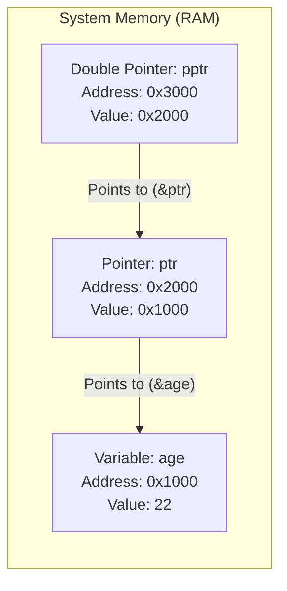

# CHAPTER 7: POINTERS IN C PROGRAMMING

[](https://en.cppreference.com/w/c)
[](https://gcc.gnu.org/)
[](https://code.visualstudio.com/)
[](https://git-scm.com/)
[](LICENSE)

> Master low-level memory management in C — understanding memory addresses, the address-of operator (`&`), the dereference operator (`*`), pointer-to-pointer structures, Call by Reference vs Call by Value, pointer arithmetic, and 8 practical problem solutions.

---

## Table of Contents

- [What is a Pointer?](#what-is-a-pointer)
- [Core Pointer Operators](#core-pointer-operators)
- [Declaring and Initializing Pointers](#declaring-and-initializing-pointers)
- [Format Specifiers for Memory Addresses](#format-specifiers-for-memory-addresses)
- [Pointer to Pointer (Double Pointers)](#pointer-to-pointer-double-pointers)
- [Call by Value vs Call by Reference](#call-by-value-vs-call-by-reference)
- [Memory Layout Visualization](#memory-layout-visualization)
- [Practice Problems and Solutions](#practice-problems-and-solutions)
- [License](#license)

---

## What is a Pointer?

A **pointer** is a special variable that stores the **memory address** of another variable, rather than storing a direct data value.

```text
┌──────────────┐          ┌──────────────┐
│  ptr (0x200) │ ───────► │  age (0x100) │
│ Holds: 0x100 │          │  Value: 22   │
└──────────────┘          └──────────────┘
```

### Why Use Pointers?
1. **Performance & Efficiency**: Pass pointers to functions instead of making slow, memory-heavy copies of large structures and arrays.
2. **Call by Reference**: Enable functions to modify variables defined in the calling function.
3. **Dynamic Memory Allocation**: Allocate, resize, and free heap memory at runtime (`malloc`, `calloc`, `free`).
4. **Data Structures**: Construct linked lists, binary trees, graphs, and dynamic tables.

---

## Core Pointer Operators

```text
┌─────────────────────────────────────────────────────────────┐
│                   The Two Fundamental Operators             │
├───────────────────┬─────────────────────────────────────────┤
│ 1. Address-of (&) │ Extracts the memory location of a       │
│                   │ variable (e.g. &age gives 0x7ffd98c).   │
│ 2. Dereference (*)│ Accesses or modifies the value stored   │
│                   │ at the pointed address (e.g. *ptr = 25).│
└───────────────────┴─────────────────────────────────────────┘
```

---

## Declaring and Initializing Pointers

A pointer variable must match the data type of the variable it points to:

```c
#include <stdio.h>

int main() {
    int age = 22;
    int *ptr = &age;      // ptr stores the memory address of age
    int _age = *ptr;      // *ptr dereferences the address to get 22

    printf("Value of age: %d\n", age);
    printf("Value via pointer: %d\n", *ptr);
    printf("Copied value: %d\n", _age);

    return 0;
}
```

### Type Matching Examples:
- **Integer Pointer**: `int *ptr = &age;`
- **Character Pointer**: `char *cptr = &star;`
- **Float Pointer**: `float *fptr = &price;`

---

## Format Specifiers for Memory Addresses

Use `%p` to print memory addresses in clean hexadecimal notation:

```c
#include <stdio.h>

int main() {
    int age = 22;
    int *ptr = &age;

    printf("Address of age (&age):  %p\n", (void *)&age);
    printf("Address stored in ptr:  %p\n", (void *)ptr);
    printf("Address of ptr itself:  %p\n", (void *)&ptr);

    return 0;
}
```

---

## Pointer to Pointer (Double Pointers)

A **pointer to a pointer** is a variable that stores the memory address of another pointer variable:

$$\text{pptr} \longrightarrow \text{ptr} \longrightarrow \text{variable}$$

```c
#include <stdio.h>

int main() {
    float price = 1000.00;
    float *ptr = &price;       // Pointer to float
    float **pptr = &ptr;      // Pointer to pointer

    printf("Price: %.2f\n", price);
    printf("Via *ptr: %.2f\n", *ptr);
    printf("Via **pptr: %.2f\n", **pptr);

    return 0;
}
```

---

## Call by Value vs Call by Reference

| Feature | Call by Value | Call by Reference |
| :--- | :--- | :--- |
| **Argument Passed** | Copy of actual variable value | Memory address (`&var`) of variable |
| **Parameter Type** | Standard variable (`int n`) | Pointer variable (`int *n`) |
| **Original Modification** | Original variable **cannot** be changed | Original variable **is directly mutated** |
| **Memory Overhead** | Higher for large objects | Extremely lightweight (single address) |

```c
#include <stdio.h>

// Call by Value: Does NOT modify the original variable
void squareByValue(int n) {
    n = n * n;
}

// Call by Reference: DIRECTLY modifies the original variable
void squareByReference(int *n) {
    *n = (*n) * (*n);
}

int main() {
    int num = 4;

    squareByValue(num);
    printf("After Call by Value: %d\n", num); // Still 4

    squareByReference(&num);
    printf("After Call by Reference: %d\n", num); // Updated to 16

    return 0;
}
```

---

## Memory Layout Visualization



---

## Practice Problems and Solutions

### Problem 1: Trace Pointer State Mutations
Determine the step-by-step output of the following pointer operations.

```c
#include <stdio.h>

int main() {
    int *ptr;
    int x;

    ptr = &x;
    *ptr = 0;
    printf("x = %d, *ptr = %d\n", x, *ptr);       // 0, 0

    *ptr += 5;
    printf("x = %d, *ptr = %d\n", x, *ptr);       // 5, 5

    (*ptr)++;
    printf("x = %d, *ptr = %d\n", x, *ptr);       // 6, 6

    return 0;
}
```

---

### Problem 2: Print Value from Pointer to Pointer
Write a program to print the value of variable `i` using its double pointer `pptr`.

```c
#include <stdio.h>

int main() {
    int i = 5;
    int *ptr = &i;
    int **pptr = &ptr;

    printf("Value of i via **pptr: %d\n", **pptr);
    return 0;
}
```

---

### Problem 3: Swap Two Numbers Using Call by Reference
Write a C program to swap two variables using pointers.

```c
#include <stdio.h>

void swap(int *a, int *b) {
    int temp = *a;
    *a = *b;
    *b = temp;
}

int main() {
    int x = 3, y = 5;

    printf("Before swap: x = %d, y = %d\n", x, y);
    swap(&x, &y);
    printf("After swap:  x = %d, y = %d\n", x, y);

    return 0;
}
```

---

### Problem 4: Address Verification (Call by Value Scope)
Does passing a variable by value retain the same memory address inside the called function?

```c
#include <stdio.h>

void printAddress(int n) {
    printf("Address in function (copy): %p\n", (void *)&n);
}

int main() {
    int n = 4;
    printf("Address in main (original): %p\n", (void *)&n);
    printAddress(n);

    // Note: The addresses are different because a copy was created on the stack!
    return 0;
}
```

---

### Problem 5: Multiple Return Values via Pointers
Write a function to calculate the Sum, Product, and Average of two numbers, and display the results in `main()`.

```c
#include <stdio.h>

void computeStats(int a, int b, int *sum, int *prod, float *avg) {
    *sum = a + b;
    *prod = a * b;
    *avg = (float)(a + b) / 2.0;
}

int main() {
    int a = 3, b = 5;
    int sum, prod;
    float avg;

    computeStats(a, b, &sum, &prod, &avg);

    printf("Numbers: %d, %d\n", a, b);
    printf("Sum:     %d\n", sum);
    printf("Product: %d\n", prod);
    printf("Average: %.2f\n", avg);

    return 0;
}
```

---

### Problem 6: Maximum Between Two Numbers Using Pointers
Find the maximum of two integers by comparing them through pointers.

```c
#include <stdio.h>

int main() {
    int a = 10, b = 20;
    int *ptr1 = &a;
    int *ptr2 = &b;
    int max;

    if (*ptr1 > *ptr2) {
        max = *ptr1;
    } else {
        max = *ptr2;
    }

    printf("Maximum number between %d and %d is: %d\n", *ptr1, *ptr2, max);
    return 0;
}
```

---

### Problem 7: Reverse Print an Array Using Indexing and Pointers
Print the elements of an array in reverse order.

```c
#include <stdio.h>

int main() {
    int arr[5] = {10, 20, 30, 40, 50};

    printf("Array in reverse order: ");
    for (int i = 4; i >= 0; i--) {
        printf("%d ", *(arr + i));
    }
    printf("\n");

    return 0;
}
```

---

### Problem 8: Print All English Alphabets Using Pointer Arithmetic
Print all 26 lowercase English alphabet letters using pointer traversal (`ptr++`).

```c
#include <stdio.h>

int main() {
    char letters[] = "abcdefghijklmnopqrstuvwxyz";
    char *ptr = letters;

    printf("Alphabet letters: ");
    for (int i = 0; i < 26; i++) {
        printf("%c ", *ptr);
        ptr++; // Advance pointer to next memory byte
    }
    printf("\n");

    return 0;
}
```

---

## License

This project is licensed under the [MIT License](LICENSE).

---

**Made with ❤️ for Beginners** • **Author: Adesh Srivastava (Tanmay)**
