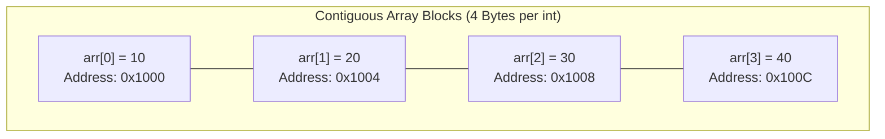

# CHAPTER 8 : ARRAYS & MULTI-DIMENSIONAL ARRAYS

[](https://en.cppreference.com/w/c)
[](https://gcc.gnu.org/)
[](https://code.visualstudio.com/)
[](https://git-scm.com/)
[](LICENSE)

> Master contiguous memory storage in C — exploring 1D arrays, 0-based indexing, pointer arithmetic (`ptr++`, pointer subtraction), arrays as function arguments, 2D matrices, and 9 step-by-step practice problems including array reversal, Fibonacci generation, and element insertion.

---

## Table of Contents

- [What is an Array?](#what-is-an-array)
- [5 Golden Rules of Arrays in C](#5-golden-rules-of-arrays-in-c)
- [Array Declaration and Initialization](#array-declaration-and-initialization)
- [Array Traversal (Input and Output)](#array-traversal-input-and-output)
- [Pointer Arithmetic in Arrays](#pointer-arithmetic-in-arrays)
- [Arrays as Function Arguments](#arrays-as-function-arguments)
- [Multi-Dimensional Arrays (2D Arrays)](#multi-dimensional-arrays-2d-arrays)
- [Contiguous Memory Layout](#contiguous-memory-layout)
- [Practice Problems and Solutions](#practice-problems-and-solutions)
- [License](#license)

---

## What is an Array?

An **array** is a collection of elements of the **same data type** stored at **contiguous (side-by-side) memory locations**.

```text
┌──────────┬──────────┬──────────┬──────────┬──────────┐
│ arr[0]   │ arr[1]   │ arr[2]   │ arr[3]   │ arr[4]   │
│  97      │  98      │  89      │  92      │  95      │
│  0x100   │  0x104   │  0x108   │  0x10C   │  0x110   │
└──────────┴──────────┴──────────┴──────────┴──────────┘
```

Instead of managing multiple variables like `score1, score2, score3`, an array allows you to store all values under a single identifier `scores[i]`.

---

## 5 Golden Rules of Arrays in C

```text
┌─────────────────────────────────────────────────────────────┐
│                 Five Crucial Array Principles               │
├────────────────────┬────────────────────────────────────────┤
│ 1. 0-Based Index   │ First element is arr[0], last is       │
│                    │ arr[size - 1].                         │
│ 2. No Bounds Check │ C does NOT check if index is valid. Out│
│                    │ of bounds causes undefined behavior.   │
│ 3. Fixed Size      │ Static arrays cannot resize at runtime.│
│ 4. No Direct Copy  │ arr1 = arr2 is invalid in C. Must loop │
│                    │ or use memcpy().                       │
│ 5. Base Pointer    │ The array name itself is a pointer to  │
│                    │ its first element (&arr[0]).           │
└────────────────────┴────────────────────────────────────────┘
```

---

## Array Declaration and Initialization

```c
#include <stdio.h>

int main() {
    // Declaration with explicit size and elements
    int marks[3] = {97, 98, 89};

    // Size inferred automatically (3 elements = 12 bytes)
    float prices[] = {100.0, 200.0, 300.0};

    printf("Physics:   %d\n", marks[0]);
    printf("Chemistry: %d\n", marks[1]);
    printf("Maths:     %d\n", marks[2]);

    return 0;
}
```

---

## Array Traversal (Input and Output)

Iterating through array elements using a `for` loop:

```c
#include <stdio.h>

int main() {
    int aadhar[5];

    // Input elements
    for (int i = 0; i < 5; i++) {
        printf("Enter number for index %d: ", i);
        scanf("%d", &aadhar[i]);
    }

    // Output elements
    printf("\nStored Array Elements:\n");
    for (int i = 0; i < 5; i++) {
        printf("Index %d: %d\n", i, aadhar[i]);
    }

    return 0;
}
```

---

## Pointer Arithmetic in Arrays

When incrementing a pointer, it shifts by `sizeof(data_type)` bytes:

$$\text{New Address} = \text{Current Address} + (\text{Step} \times \text{sizeof(Type)})$$

```text
• int*   (4 bytes) ── ptr++ ──► moves 4 bytes forward
• float* (4 bytes) ── ptr++ ──► moves 4 bytes forward
• char*  (1 byte)  ── ptr++ ──► moves 1 byte forward
```

### Essential Pointer Arithmetic Operations:

```c
#include <stdio.h>

int main() {
    int arr[] = {10, 20, 30, 40, 50};
    int *ptr1 = &arr[0];
    int *ptr2 = &arr[3];

    // 1. Dereferencing offset
    printf("*(ptr1 + 2) = %d\n", *(ptr1 + 2)); // arr[2] = 30

    // 2. Pointer Subtraction (Gives number of elements between them)
    printf("ptr2 - ptr1 = %ld elements\n", ptr2 - ptr1); // 3

    // 3. Pointer Comparison
    if (ptr1 < ptr2) {
        printf("ptr1 points to an earlier memory address than ptr2\n");
    }

    return 0;
}
```

---

## Arrays as Function Arguments

When an array is passed to a function, C automatically passes the **memory address of the first element** (`&arr[0]`). Any modifications made inside the function permanently affect the original array:

```c
#include <stdio.h>

// Both declarations are completely equivalent:
// void printArray(int arr[], int n)
void printArray(int *arr, int n) {
    for (int i = 0; i < n; i++) {
        printf("%d\t", arr[i]);
    }
    printf("\n");
}

int main() {
    int numbers[] = {1, 2, 3, 4, 5};
    printArray(numbers, 5); // Passes &numbers[0]
    return 0;
}
```

---

## Multi-Dimensional Arrays (2D Arrays)

A **2D Array** represents data in a matrix format of **Rows $\times$ Columns**:

```c
#include <stdio.h>

int main() {
    // 2 Students x 3 Subjects
    int marks[2][3] = {
        {90, 87, 91},  // Student 0
        {88, 92, 85}   // Student 1
    };

    printf("Student 0, Subject 1: %d\n", marks[0][1]); // 87
    printf("Student 1, Subject 2: %d\n", marks[1][2]); // 85

    return 0;
}
```

---

## Contiguous Memory Layout



---

## Practice Problems and Solutions

### Problem 1: Price of 3 Items with 18% GST
Write a program to enter prices of 3 items and print their final cost including 18% GST.

```c
#include <stdio.h>

int main() {
    float price[3];

    for (int i = 0; i < 3; i++) {
        printf("Enter price for Item %d: ", i + 1);
        scanf("%f", &price[i]);
    }

    printf("\n--- Final Bills (with 18%% GST) ---\n");
    for (int i = 0; i < 3; i++) {
        float finalPrice = price[i] + (0.18 * price[i]);
        printf("Item %d: Original = %.2f, Total with GST = %.2f\n", i + 1, price[i], finalPrice);
    }

    return 0;
}
```

---

### Problem 2: Count Odd Numbers in an Array
Write a function to count how many odd numbers exist in an integer array.

```c
#include <stdio.h>

int countOdd(int arr[], int n) {
    int count = 0;
    for (int i = 0; i < n; i++) {
        if (arr[i] % 2 != 0) {
            count++;
        }
    }
    return count;
}

int main() {
    int arr[] = {1, 2, 3, 4, 5, 6, 7, 8};
    printf("Total odd numbers: %d\n", countOdd(arr, 8));
    return 0;
}
```

---

### Problem 3: Evaluating Array Pointer Offsets
Given `int arr[] = {1, 2, 3, 4, 5, 6, 7, 8};`, what will `*(arr + 2)` and `*(arr + 5)` evaluate to?

```c
#include <stdio.h>

int main() {
    int arr[] = {1, 2, 3, 4, 5, 6, 7, 8};

    printf("*(arr + 2) = %d\n", *(arr + 2)); // Index 2 -> 3
    printf("*(arr + 5) = %d\n", *(arr + 5)); // Index 5 -> 6

    return 0;
}
```

---

### Problem 4: Reverse an Array
Write a function to reverse the elements of an array in-place.

```c
#include <stdio.h>

void reverseArray(int arr[], int n) {
    int start = 0;
    int end = n - 1;

    while (start < end) {
        int temp = arr[start];
        arr[start] = arr[end];
        arr[end] = temp;
        start++;
        end--;
    }
}

void printArray(int arr[], int n) {
    for (int i = 0; i < n; i++) {
        printf("%d ", arr[i]);
    }
    printf("\n");
}

int main() {
    int arr[] = {1, 2, 3, 4, 5};

    printf("Original: ");
    printArray(arr, 5);

    reverseArray(arr, 5);

    printf("Reversed: ");
    printArray(arr, 5);

    return 0;
}
```

---

### Problem 5: Store First N Fibonacci Numbers
Write a program to generate and store the first $N$ Fibonacci numbers in an array ($N > 2$).

```c
#include <stdio.h>

int main() {
    int n;
    printf("Enter N (N > 2): ");
    scanf("%d", &n);

    int fib[n];
    fib[0] = 0;
    fib[1] = 1;

    for (int i = 2; i < n; i++) {
        fib[i] = fib[i - 1] + fib[i - 2];
    }

    printf("First %d Fibonacci Numbers: ", n);
    for (int i = 0; i < n; i++) {
        printf("%d ", fib[i]);
    }
    printf("\n");

    return 0;
}
```

---

### Problem 6: 2D Array for Multiplication Tables of 2 and 3
Store multiplication tables of 2 and 3 inside a 2D array and display them.

```c
#include <stdio.h>

int main() {
    int table[2][10];

    // Row 0 stores Table of 2, Row 1 stores Table of 3
    for (int col = 0; col < 10; col++) {
        table[0][col] = 2 * (col + 1);
        table[1][col] = 3 * (col + 1);
    }

    printf("Table of 2:\n");
    for (int j = 0; j < 10; j++) {
        printf("2 x %2d = %d\n", j + 1, table[0][j]);
    }

    printf("\nTable of 3:\n");
    for (int j = 0; j < 10; j++) {
        printf("3 x %2d = %d\n", j + 1, table[1][j]);
    }

    return 0;
}
```

---

### Problem 7: Count Element Occurrences
Write a program to count how many times a number $X$ occurs in an array.

```c
#include <stdio.h>

int countOccurrences(int arr[], int n, int x) {
    int count = 0;
    for (int i = 0; i < n; i++) {
        if (arr[i] == x) {
            count++;
        }
    }
    return count;
}

int main() {
    int arr[] = {2, 5, 3, 5, 8, 5, 1, 5, 9, 5};
    int target = 5;

    int occurrences = countOccurrences(arr, 10, target);
    printf("Number %d occurs %d times in the array.\n", target, occurrences);

    return 0;
}
```

---

### Problem 8: Find the Largest Number in an Array
Write a program to find and print the maximum integer in an array.

```c
#include <stdio.h>

int findLargest(int arr[], int n) {
    int largest = arr[0];
    for (int i = 1; i < n; i++) {
        if (arr[i] > largest) {
            largest = arr[i];
        }
    }
    return largest;
}

int main() {
    int arr[] = {15, 42, 8, 95, 23, 67, 34, 88, 12, 50};
    printf("The largest element is: %d\n", findLargest(arr, 10));
    return 0;
}
```

---

### Problem 9: Insert an Element at the End of an Array
Write a function to insert a new element at the end of an array.

```c
#include <stdio.h>

void insertAtEnd(int arr[], int *n, int element) {
    arr[*n] = element;
    (*n)++; // Increment active count
}

int main() {
    int arr[20] = {10, 20, 30, 40, 50};
    int size = 5;

    printf("Initial Array: ");
    for (int i = 0; i < size; i++) {
        printf("%d ", arr[i]);
    }
    printf("\n");

    int newElement = 60;
    insertAtEnd(arr, &size, newElement);

    printf("After Insertion: ");
    for (int i = 0; i < size; i++) {
        printf("%d ", arr[i]);
    }
    printf("\n");

    return 0;
}
```

---

## License

This project is licensed under the [MIT License](LICENSE).

---

**Made with ❤️ for Beginners** • **Author: Adesh Srivastava (Tanmay)**