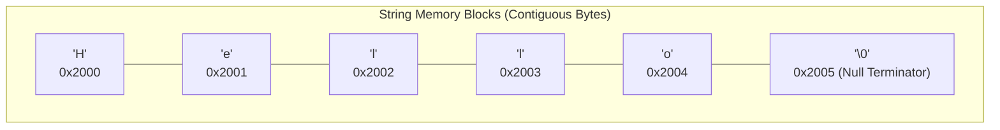

# CHAPTER 9: STRINGS IN C

[](https://en.cppreference.com/w/c)
[](https://gcc.gnu.org/)
[](https://code.visualstudio.com/)
[](https://git-scm.com/)
[](LICENSE)

> Master string manipulation in C — understanding null termination (`\0`), memory layout, array strings vs pointer literals, safe input via `fgets()`, standard library functions (`<string.h>`), and 12 practical problem solutions including password salting, string slicing, and frequency counting.

---

## Table of Contents

- [What is a String in C?](#what-is-a-string-in-c)
- [Declaring and Initializing Strings](#declaring-and-initializing-strings)
- [Modifiable Array vs Read-Only Pointer String](#modifiable-array-vs-read-only-pointer-string)
- [String Input and Output](#string-input-and-output)
- [Standard Library Functions (string.h)](#standard-library-functions-stringh)
- [String Memory Layout](#string-memory-layout)
- [Practice Problems and Solutions](#practice-problems-and-solutions)
- [License](#license)

---

## What is a String in C?

In C, there is no primitive `string` data type. Instead, a **string** is a **1D array of characters terminated by a special null character (`\0`)**.

```text
┌───┬───┬───┬───┬───┬──────┐
│ H │ e │ l │ l │ o │  \0  │
└───┴───┴───┴───┴───┴──────┘
```

The null terminator `\0` (ASCII value `0`) tells standard library functions exactly where the string ends in memory.

---

## Declaring and Initializing Strings

```text
┌─────────────────────────────────────────────────────────────┐
│                 Two Ways to Declare Strings                 │
├────────────────────┬────────────────────────────────────────┤
│ 1. Character Array │ char str[] = {'H','e','l','l','o','\0'}│
│ 2. String Literal  │ char str[] = "Hello"; (Auto adds '\0') │
└────────────────────┴────────────────────────────────────────┘
```

```c
#include <stdio.h>

int main() {
    char name[] = {'S', 'a', 'm', 'p', 'l', 'e', '\0'};
    char greeting[] = "Hello World"; // Compiler automatically appends '\0'

    printf("Name: %s\n", name);
    printf("Greeting: %s\n", greeting);

    return 0;
}
```

> **Important Rule**: Always allocate **1 extra byte** for the null terminator. A 5-letter word like `"Apple"` requires an array of size at least `6` (`char fruit[6] = "Apple";`).

---

## Modifiable Array vs Read-Only Pointer String

| Type | Declaration | Modifiable? | Memory Location |
| :--- | :--- | :--- | :--- |
| **Character Array** | `char str[] = "Hello";` | **Yes** (`str[0] = 'J';`) | Stack memory |
| **Pointer Literal** | `char *str = "Hello";` | **No (Read-only)** | Text / Constant segment |

```c
#include <stdio.h>

int main() {
    // 1. Modifiable Array String
    char modifiable[] = "Hello";
    modifiable[0] = 'J';
    printf("Modified array: %s\n", modifiable); // "Jello"

    // 2. Pointer Literal (Reassignable to a new address, but individual bytes cannot be modified)
    char *ptrStr = "Hello";
    ptrStr = "Hello World Again"; // Valid reassignment
    printf("Reassigned pointer: %s\n", ptrStr);

    return 0;
}
```

---

## String Input and Output

### 1. The Pitfalls of `scanf("%s", str)`:
- `scanf("%s", ...)` stops reading at the first whitespace space or tab.
- Has no buffer bounds checking, creating high risk for **Buffer Overflows**.

### 2. The Safe Solution: `fgets()` and `puts()`:
- **`fgets(str, size, stdin)`**: Reads full sentences including spaces up to `size - 1` characters.
- **`puts(str)`**: Prints the string followed automatically by a newline.

```c
#include <stdio.h>

int main() {
    char fullName[100];

    printf("Enter your full name: ");
    fgets(fullName, sizeof(fullName), stdin);

    printf("Welcome: ");
    puts(fullName);

    return 0;
}
```

---

## Standard Library Functions (string.h)

| Function | Signature | Description | Example |
| :--- | :--- | :--- | :--- |
| **`strlen`** | `size_t strlen(const char *str);` | Returns length excluding `\0` | `strlen("Apple")` $\rightarrow 5$ |
| **`strcpy`** | `char *strcpy(char *dest, const char *src);` | Copies source to destination | `strcpy(target, source);` |
| **`strcat`** | `char *strcat(char *dest, const char *src);` | Appends source to destination | `strcat(first, second);` |
| **`strcmp`** | `int strcmp(const char *s1, const char *s2);` | Compares ASCII values | `0` if equal, `<0` or `>0` |

---

## String Memory Layout



---

## Practice Problems and Solutions

### Problem 1: Print First and Last Name Using a Loop
Store first and last name in separate strings and print them character-by-character.

```c
#include <stdio.h>

void printString(const char str[]) {
    for (int i = 0; str[i] != '\0'; i++) {
        printf("%c ", str[i]);
    }
    printf("\n");
}

int main() {
    char firstName[] = "Tanmay";
    char lastName[] = "Srivastava";

    printf("First Name: ");
    printString(firstName);

    printf("Last Name:  ");
    printString(lastName);

    return 0;
}
```

---

### Problem 2: Full Name Input with Spaces
Take user full name as input and print it back using `fgets()`.

```c
#include <stdio.h>

int main() {
    char fullName[100];

    printf("Enter your full name: ");
    fgets(fullName, sizeof(fullName), stdin);

    printf("Your full name is: %s", fullName);
    return 0;
}
```

---

### Problem 3: Custom String Length Function
Compute the length of a string without using library functions.

```c
#include <stdio.h>

int countLength(const char str[]) {
    int length = 0;
    while (str[length] != '\0') {
        length++;
    }
    // Remove newline if entered via fgets
    if (length > 0 && str[length - 1] == '\n') {
        length--;
    }
    return length;
}

int main() {
    char name[100];
    printf("Enter name: ");
    fgets(name, sizeof(name), stdin);

    printf("Length of string: %d\n", countLength(name));
    return 0;
}
```

---

### Problem 4: Read String Character-by-Character with %c
Read user input character-by-character until a newline (`\n`) is encountered.

```c
#include <stdio.h>

int main() {
    char str[100];
    char ch;
    int i = 0;

    printf("Enter characters: ");
    while (1) {
        scanf("%c", &ch);
        if (ch == '\n') {
            break;
        }
        str[i] = ch;
        i++;
    }
    str[i] = '\0'; // Add null terminator

    printf("Captured String: %s\n", str);
    return 0;
}
```

---

### Problem 5: Password Salting
Append a secret salt `"123"` at the end of a user password.

```c
#include <stdio.h>
#include <string.h>

int main() {
    char password[100];
    char salt[] = "123";

    printf("Enter password: ");
    scanf("%90s", password);

    strcat(password, salt);
    printf("Salted Password: %s\n", password);

    return 0;
}
```

---

### Problem 6: Custom String Slice Function
Write a function `slice(str, n, m)` that extracts characters from index $n$ to $m$.

```c
#include <stdio.h>
#include <stdlib.h>
#include <string.h>

char *slice(const char *str, int n, int m) {
    int len = m - n + 1;
    char *result = (char *)malloc(len + 1);

    strncpy(result, str + n, len);
    result[len] = '\0';

    return result;
}

int main() {
    char *sub = slice("Programming", 3, 6);
    printf("Sliced substring (indices 3-6): %s\n", sub); // "gram"
    free(sub);
    return 0;
}
```

---

### Problem 7: Count Total Vowels in a String
Count all vowels (both lowercase and uppercase) in a string.

```c
#include <stdio.h>

int countVowels(const char *str) {
    int count = 0;
    for (int i = 0; str[i] != '\0'; i++) {
        char c = str[i];
        if (c == 'a' || c == 'e' || c == 'i' || c == 'o' || c == 'u' ||
            c == 'A' || c == 'E' || c == 'I' || c == 'O' || c == 'U') {
            count++;
        }
    }
    return count;
}

int main() {
    char text[] = "Hello World in C Programming";
    printf("Total vowels: %d\n", countVowels(text));
    return 0;
}
```

---

### Problem 8: Check Character Existence
Check whether a target character exists within a given string.

```c
#include <stdio.h>

int isPresent(const char *str, char target) {
    for (int i = 0; str[i] != '\0'; i++) {
        if (str[i] == target) {
            return 1;
        }
    }
    return 0;
}

int main() {
    char text[] = "Programming";
    char target = 'm';

    if (isPresent(text, target)) {
        printf("Character '%c' is present.\n", target);
    } else {
        printf("Character '%c' is NOT present.\n", target);
    }

    return 0;
}
```

---

### Problem 9: Convert Lowercase Vowels to Uppercase
Convert all lowercase vowels to uppercase in-place using ASCII arithmetic (`ch - 32`).

```c
#include <stdio.h>

void uppercaseVowels(char *str) {
    for (int i = 0; str[i] != '\0'; i++) {
        if (str[i] == 'a' || str[i] == 'e' || str[i] == 'i' ||
            str[i] == 'o' || str[i] == 'u') {
            str[i] = str[i] - 32;
        }
    }
}

int main() {
    char text[] = "education is important";

    printf("Original: %s\n", text);
    uppercaseVowels(text);
    printf("Modified: %s\n", text);

    return 0;
}
```

---

### Problem 10: Find Highest Frequency Character
Determine the character that appears most frequently in a string.

```c
#include <stdio.h>

int main() {
    char str[100];
    int freq[256] = {0};
    int maxFreq = 0;
    char maxChar = '\0';

    printf("Enter string: ");
    fgets(str, sizeof(str), stdin);

    for (int i = 0; str[i] != '\0'; i++) {
        if (str[i] != '\n') {
            freq[(unsigned char)str[i]]++;
        }
    }

    for (int i = 0; i < 256; i++) {
        if (freq[i] > maxFreq) {
            maxFreq = freq[i];
            maxChar = (char)i;
        }
    }

    printf("Highest frequency character: '%c' (appears %d times)\n", maxChar, maxFreq);
    return 0;
}
```

---

### Problem 11: Remove All Blank Spaces from a String
Remove all blank spaces in a string in-place.

```c
#include <stdio.h>

int main() {
    char str[100];
    int j = 0;

    printf("Enter a string with spaces: ");
    fgets(str, sizeof(str), stdin);

    for (int i = 0; str[i] != '\0'; i++) {
        if (str[i] != ' ') {
            str[j] = str[i];
            j++;
        }
    }
    str[j] = '\0';

    printf("String without spaces: %s", str);
    return 0;
}
```

---

### Problem 12: Toggle Case (Uppercase to Lowercase & Vice Versa)
Toggle lowercase characters to uppercase and uppercase characters to lowercase.

```c
#include <stdio.h>

int main() {
    char str[100];

    printf("Enter a string: ");
    fgets(str, sizeof(str), stdin);

    for (int i = 0; str[i] != '\0'; i++) {
        if (str[i] >= 'a' && str[i] <= 'z') {
            str[i] = str[i] - 32;
        } else if (str[i] >= 'A' && str[i] <= 'Z') {
            str[i] = str[i] + 32;
        }
    }

    printf("Toggled string: %s", str);
    return 0;
}
```

---

## License

This project is licensed under the [MIT License](LICENSE).

---

**Made with ❤️ for Beginners** • **Author: Adesh Srivastava (Tanmay)**