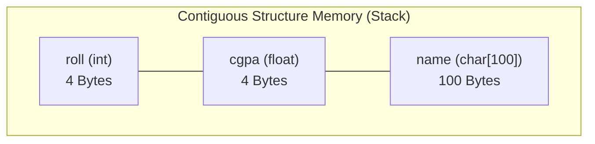

# CHAPTER 10: STRUCTURE IN C

[](https://en.cppreference.com/w/c)
[](https://gcc.gnu.org/)
[](https://code.visualstudio.com/)
[](https://git-scm.com/)
[](LICENSE)

> Master heterogeneous data grouping in C — defining custom data types with `struct`, accessing members via the dot (`.`) and arrow (`->`) operators, creating arrays of structures, passing structures to functions, simplifying signatures using `typedef`, and 6 comprehensive real-world problem solutions.

---

## Table of Contents

- [What is a Structure?](#what-is-a-structure)
- [Structures vs Arrays](#structures-vs-arrays)
- [Defining and Initializing Structures](#defining-and-initializing-structures)
- [Array of Structures](#array-of-structures)
- [Pointers to Structures and the Arrow Operator](#pointers-to-structures-and-the-arrow-operator)
- [Passing Structures to Functions](#passing-structures-to-functions)
- [The typedef Keyword](#the-typedef-keyword)
- [Structure Memory Layout](#structure-memory-layout)
- [Practice Problems and Solutions](#practice-problems-and-solutions)
- [License](#license)

---

## What is a Structure?

A **structure** (`struct`) is a user-defined data type in C that allows you to group variables of **different data types** under a single name.

```text
┌────────────────────────────────────────┐
│             struct Student             │
├──────────────┬──────────────┬──────────┤
│ name (char[])│ roll (int)   │cgpa(float│
│  "Tanmay"    │  18979       │  9.20    │
└──────────────┴──────────────┴──────────┘
```

A structure definition serves as an architectural **blueprint**. It consumes $0$ bytes of memory until an actual variable of that structure type is instantiated.

---

## Structures vs Arrays

| Feature | Array | Structure (`struct`) |
| :--- | :--- | :--- |
| **Data Types** | Homogeneous (same type only) | **Heterogeneous** (mix int, float, string, etc.) |
| **Memory Access** | 0-based index offset (`arr[0]`) | Named field members (`s1.roll`) |
| **Entity Modeling** | Lists and mathematical vectors | Real-world objects (Student, Bank Account) |
| **Assignment** | Cannot copy using `=` | **Can directly copy** using `s2 = s1;` |

---

## Defining and Initializing Structures

```c
#include <stdio.h>
#include <string.h>

// 1. Structure Definition (Blueprint)
struct Student {
    int roll;
    float cgpa;
    char name[100];
};

int main() {
    // 2. Declaration and Member Assignment via Dot Operator (.)
    struct Student s1;
    s1.roll = 18979;
    s1.cgpa = 9.2;
    strcpy(s1.name, "Tanmay");

    // 3. Direct Inline Initialization
    struct Student s2 = {18980, 8.7, "Anushka"};

    // 4. Zero-Initialization
    struct Student s3 = {0};

    printf("Student 1: %s | Roll: %d | CGPA: %.2f\n", s1.name, s1.roll, s1.cgpa);
    printf("Student 2: %s | Roll: %d | CGPA: %.2f\n", s2.name, s2.roll, s2.cgpa);

    return 0;
}
```

---

## Array of Structures

You can create an array where every individual element is a complete structure:

```c
#include <stdio.h>
#include <string.h>

struct Student {
    int roll;
    float cgpa;
    char name[100];
};

int main() {
    struct Student ece[100]; // Stores up to 100 students

    ece[0].roll = 1164;
    ece[0].cgpa = 9.2;
    strcpy(ece[0].name, "Tanmay");

    printf("ECE Student 0: Name = %s, Roll = %d, CGPA = %.2f\n",
           ece[0].name, ece[0].roll, ece[0].cgpa);

    return 0;
}
```

---

## Pointers to Structures and the Arrow Operator

When dealing with a pointer to a structure, accessing fields with `(*ptr).field` can become clumsy. C provides the **Arrow Operator (`->`)** as clean shorthand:

$$\text{(*ptr).member} \iff \text{ptr->member}$$

```c
#include <stdio.h>

struct Student {
    int roll;
    float cgpa;
    char name[100];
};

int main() {
    struct Student s1 = {1664, 9.2, "Tanmay"};
    struct Student *ptr = &s1;

    // Access via dereference
    printf("Roll (Dereference): %d\n", (*ptr).roll);

    // Access via Arrow Operator (Recommended)
    printf("Roll (Arrow):       %d\n", ptr->roll);
    printf("CGPA (Arrow):       %.2f\n", ptr->cgpa);

    return 0;
}
```

---

## Passing Structures to Functions

Structures can be passed to functions either **By Value** (creates a copy) or **By Reference** (passes a pointer for efficiency):

```c
#include <stdio.h>

struct Student {
    int roll;
    float cgpa;
    char name[100];
};

// Pass by Reference via pointer to avoid copying overhead
void printStudent(const struct Student *s) {
    printf("--- Student Card ---\n");
    printf("Name: %s\n", s->name);
    printf("Roll: %d\n", s->roll);
    printf("CGPA: %.2f\n", s->cgpa);
}

int main() {
    struct Student s1 = {1664, 9.2, "Tanmay"};
    printStudent(&s1);
    return 0;
}
```

---

## The typedef Keyword

The `typedef` keyword creates a concise **alias (nickname)** for complex data types, removing the need to repeatedly type `struct`:

```c
#include <stdio.h>
#include <string.h>

typedef struct ComputerEngineeringStudent {
    int roll;
    float cgpa;
    char name[100];
} COE; // COE is now an alias for struct ComputerEngineeringStudent

int main() {
    COE s1; // Clean declaration without 'struct' keyword
    s1.roll = 1664;
    s1.cgpa = 9.2;
    strcpy(s1.name, "Tanmay");

    printf("Student: %s (Roll: %d)\n", s1.name, s1.roll);
    return 0;
}
```

---

## Structure Memory Layout



---

## Practice Problems and Solutions

### Problem 1: Store and Display Data of 3 Students
Write a program to store and print details (`roll`, `cgpa`, `name`) of 3 students.

```c
#include <stdio.h>
#include <string.h>

struct Student {
    int roll;
    float cgpa;
    char name[100];
};

int main() {
    struct Student s[3];

    s[0].roll = 18977; s[0].cgpa = 9.2; strcpy(s[0].name, "Tanmay");
    s[1].roll = 18978; s[1].cgpa = 8.7; strcpy(s[1].name, "Pearl");
    s[2].roll = 18979; s[2].cgpa = 9.0; strcpy(s[2].name, "Anushka");

    for (int i = 0; i < 3; i++) {
        printf("Student %d: Name = %-10s | Roll = %d | CGPA = %.2f\n",
               i + 1, s[i].name, s[i].roll, s[i].cgpa);
    }

    return 0;
}
```

---

### Problem 2: Address Directory of 5 People
Create an address structure (`houseNo`, `blockNo`, `city`, `state`) and print address records for 5 individuals.

```c
#include <stdio.h>

struct Address {
    int houseNo;
    int blockNo;
    char city[50];
    char state[50];
};

void printAddress(struct Address add, int personNum) {
    printf("Person %d Address: House #%d, Block %d, %s, %s\n",
           personNum, add.houseNo, add.blockNo, add.city, add.state);
}

int main() {
    struct Address people[5] = {
        {101, 4, "Delhi", "Delhi"},
        {204, 2, "Mumbai", "Maharashtra"},
        {305, 9, "Bangalore", "Karnataka"},
        {412, 1, "Lucknow", "Uttar Pradesh"},
        {501, 7, "Jaipur", "Rajasthan"}
    };

    for (int i = 0; i < 5; i++) {
        printAddress(people[i], i + 1);
    }

    return 0;
}
```

---

### Problem 3: Vector Addition with Structures
Create a structure to represent a 2D vector and write a function to calculate the sum of two vectors.

```c
#include <stdio.h>

struct Vector {
    int x;
    int y;
};

struct Vector addVectors(struct Vector v1, struct Vector v2) {
    struct Vector result;
    result.x = v1.x + v2.x;
    result.y = v1.y + v2.y;
    return result;
}

int main() {
    struct Vector v1 = {5, 10};
    struct Vector v2 = {3, 7};

    struct Vector sum = addVectors(v1, v2);

    printf("Vector 1: (%d, %d)\n", v1.x, v1.y);
    printf("Vector 2: (%d, %d)\n", v2.x, v2.y);
    printf("Sum:      (%d, %d)\n", sum.x, sum.y);

    return 0;
}
```

---

### Problem 4: Complex Numbers with Arrow Operator
Create a structure to store complex numbers ($a + bi$) and display fields using pointer arrow notation.

```c
#include <stdio.h>

struct Complex {
    int real;
    int img;
};

int main() {
    struct Complex c1 = {5, 8};
    struct Complex *ptr = &c1;

    printf("Real Part:      %d\n", ptr->real);
    printf("Imaginary Part: %d\n", ptr->img);
    printf("Complex Number: %d + %di\n", ptr->real, ptr->img);

    return 0;
}
```

---

### Problem 5: Array vs Structure Choice Analysis
**Question**: To store marks of 30 students in a class, which structure design is preferred?

```text
Option A: float marks[30]; (Simple list if only numerical marks are needed)
Option B: struct Student { int roll; char name[50]; float marks; } class[30];
          (Best for full student profiles)
```

---

### Problem 6: Bank Account Management with Typedef
Create a `BankAccount` structure with `typedef` to store customer records.

```c
#include <stdio.h>
#include <string.h>

typedef struct {
    int accountNumber;
    char customerName[50];
    char accountType[20];
    float balance;
    char phoneNumber[15];
    int pinCode;
    char openingDate[20];
} BankAccount;

int main() {
    BankAccount customer1 = {
        100234,
        "Tanmay Srivastava",
        "SAVINGS",
        45250.75,
        "+91-9876543210",
        4321,
        "15-08-2024"
    };

    printf("=== ABC BANK - CUSTOMER RECORD ===\n");
    printf("Account Number: %d\n", customer1.accountNumber);
    printf("Customer Name:  %s\n", customer1.customerName);
    printf("Account Type:   %s\n", customer1.accountType);
    printf("Balance:        INR %.2f\n", customer1.balance);
    printf("Phone Number:   %s\n", customer1.phoneNumber);
    printf("Opening Date:   %s\n", customer1.openingDate);

    return 0;
}
```

---

## License

This project is licensed under the [MIT License](LICENSE).

---

**Made with ❤️ for Beginners** • **Author: Adesh Srivastava (Tanmay)**
