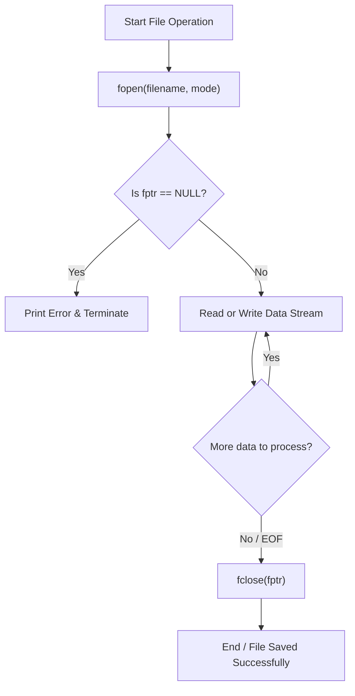

# CHAPTER 11 : FILE INPUT / OUTPUT (FILE I/O)

[](https://en.cppreference.com/w/c)
[](https://gcc.gnu.org/)
[](https://code.visualstudio.com/)
[](https://git-scm.com/)
[](LICENSE)

> Master persistent disk storage in C — understanding the `FILE *` structure, the 3-step file lifecycle (`fopen`, process, `fclose`), complete file access modes, character and formatted stream I/O (`fgetc`, `fputc`, `fprintf`, `fscanf`), EOF parsing, `fseek()` file cursor navigation, and 7 step-by-step practice problems.

---

## Table of Contents

- [What is File I/O?](#what-is-file-io)
- [The 3-Step File Lifecycle](#the-3-step-file-lifecycle)
- [Complete File Opening Modes](#complete-file-opening-modes)
- [Reading and Writing Operations](#reading-and-writing-operations)
- [The EOF (End of File) Concept](#the-eof-end-of-file-concept)
- [File Cursor Positioning with fseek()](#file-cursor-positioning-with-fseek)
- [File I/O Execution Flowchart](#file-io-execution-flowchart)
- [Practice Problems and Solutions](#practice-problems-and-solutions)
- [License](#license)

---

## What is File I/O?

RAM (Random Access Memory) is **volatile** — all variables and data are destroyed the moment a program closes. **File I/O** enables programs to store and retrieve data **permanently** on physical storage devices.

In C, files are treated as a continuous **stream of bytes** accessed through a structure pointer `FILE *` defined in `<stdio.h>`.

---

## The 3-Step File Lifecycle

```text
┌─────────────────────────────────────────────────────────────┐
│                 Three Mandatory Steps of File I/O           │
├────────────────────┬────────────────────────────────────────┤
│ 1. Open File       │ fptr = fopen("data.txt", "r");         │
│ 2. Process Data    │ Read (fscanf/fgetc) or Write (fprintf) │
│ 3. Close File      │ fclose(fptr); (Flushes buffer to disk) │
└────────────────────┴────────────────────────────────────────┘
```

> **Crucial Rule**: Always verify that `fptr != NULL` before reading or writing. If opening fails, accessing a `NULL` pointer causes an immediate crash.

---

## Complete File Opening Modes

| Mode | Type | Purpose | Behavior if File Exists | Behavior if Missing |
| :--- | :--- | :--- | :--- | :--- |
| `"r"` | Text | Read only | Opens from start | Returns `NULL` |
| `"w"` | Text | Write only | **Truncates (erases all data)** | Creates new file |
| `"a"` | Text | Append only | Preserves data, writes at end | Creates new file |
| `"r+"` | Text | Read & Write | Opens from start without erasing | Returns `NULL` |
| `"w+"` | Text | Read & Write | **Truncates to 0 bytes** | Creates new file |
| `"a+"` | Text | Read & Append | Preserves data, writes at end | Creates new file |
| `"rb"` / `"wb"` | Binary | Binary Read / Write | Raw byte stream | Same as text rules |

---

## Reading and Writing Operations

```c
#include <stdio.h>

int main() {
    FILE *fptr = fopen("example.txt", "w");
    if (fptr == NULL) {
        printf("Error creating file!\n");
        return 1;
    }

    // 1. Formatted write (fprintf)
    fprintf(fptr, "Roll: %d, GPA: %.2f\n", 101, 9.45);

    // 2. Character write (fputc)
    fputc('A', fptr);

    fclose(fptr); // Flushes cache & saves to disk
    return 0;
}
```

---

## The EOF (End of File) Concept

`EOF` is a pre-defined macro in `<stdio.h>` (typically with value `-1`) returned by stream reading functions (`fgetc()`) when the end of a file is reached:

```c
#include <stdio.h>

int main() {
    FILE *fptr = fopen("example.txt", "r");
    if (fptr == NULL) {
        printf("File not found!\n");
        return 1;
    }

    int ch;
    // Read every character until EOF is encountered
    while ((ch = fgetc(fptr)) != EOF) {
        printf("%c", ch);
    }

    fclose(fptr);
    return 0;
}
```

---

## File Cursor Positioning with fseek()

The `fseek()` function moves the active reading/writing cursor to an exact byte offset:

$$\text{fseek(fptr, offset, origin);}$$

- **`SEEK_SET`**: Beginning of the file.
- **`SEEK_CUR`**: Current position of the file cursor.
- **`SEEK_END`**: End of the file.

```c
// Rewind back to the beginning of the file
fseek(fptr, 0, SEEK_SET);
```

---

## File I/O Execution Flowchart



---

## Practice Problems and Solutions

### Problem 1: Read 5 Integers from a File
Write a program to read 5 integers from a file named `numbers.txt` and display them on the console.

```c
#include <stdio.h>

int main() {
    FILE *fptr = fopen("numbers.txt", "r");
    if (fptr == NULL) {
        printf("Error: Could not open numbers.txt\n");
        return 1;
    }

    int num;
    printf("Reading 5 integers:\n");
    for (int i = 0; i < 5; i++) {
        if (fscanf(fptr, "%d", &num) == 1) {
            printf("Integer %d: %d\n", i + 1, num);
        }
    }

    fclose(fptr);
    return 0;
}
```

---

### Problem 2: Write Student Information to a File
Write a program to collect student details (`Name`, `Age`, `GPA`) from the user and save them to `students.txt`.

```c
#include <stdio.h>

int main() {
    FILE *fptr = fopen("students.txt", "w");
    if (fptr == NULL) {
        printf("Error opening file for writing!\n");
        return 1;
    }

    char name[100];
    int age;
    float gpa;

    printf("Enter Student Name: ");
    scanf("%99s", name);
    printf("Enter Age: ");
    scanf("%d", &age);
    printf("Enter GPA: ");
    scanf("%f", &gpa);

    fprintf(fptr, "Name: %s\nAge:  %d\nGPA:  %.2f\n", name, age, gpa);
    fclose(fptr);

    printf("Student records written to students.txt successfully!\n");
    return 0;
}
```

---

### Problem 3: Write All Odd Numbers from 1 to N
Write a program to generate and write all odd integers from $1$ to $N$ into `odd_numbers.txt`.

```c
#include <stdio.h>

int main() {
    FILE *fptr = fopen("odd_numbers.txt", "w");
    if (fptr == NULL) {
        printf("Error opening file!\n");
        return 1;
    }

    int n;
    printf("Enter N: ");
    scanf("%d", &n);

    for (int i = 1; i <= n; i++) {
        if (i % 2 != 0) {
            fprintf(fptr, "%d\n", i);
        }
    }

    fclose(fptr);
    printf("Odd numbers up to %d saved to odd_numbers.txt!\n", n);
    return 0;
}
```

---

### Problem 4: Read Two Numbers and Overwrite with Their Sum
Given `numbers.txt` containing two integers, read both numbers and overwrite the file with their sum using `fseek()`.

```c
#include <stdio.h>

int main() {
    FILE *fptr = fopen("numbers.txt", "r+");
    if (fptr == NULL) {
        printf("Error opening file!\n");
        return 1;
    }

    int a, b;
    fscanf(fptr, "%d %d", &a, &b);
    int sum = a + b;

    // Reposition cursor to start of file
    fseek(fptr, 0, SEEK_SET);
    fprintf(fptr, "%d\n", sum);

    fclose(fptr);
    printf("Replaced %d and %d with sum %d in numbers.txt\n", a, b, sum);
    return 0;
}
```

---

### Problem 5: Read String from File
Read a word from `string.txt` and display it to the user.

```c
#include <stdio.h>

int main() {
    FILE *fptr = fopen("string.txt", "r");
    if (fptr == NULL) {
        printf("Error opening string.txt\n");
        return 1;
    }

    char str[100];
    fscanf(fptr, "%99s", str);
    printf("Read from file: %s\n", str);

    fclose(fptr);
    return 0;
}
```

---

### Problem 6: Count Vowels and Overwrite File with Count
Read a string from `string.txt`, count its vowels, and overwrite the file with the vowel count.

```c
#include <stdio.h>

int main() {
    FILE *fptr = fopen("string.txt", "r+");
    if (fptr == NULL) {
        printf("Error opening file!\n");
        return 1;
    }

    char str[100];
    fscanf(fptr, "%99s", str);

    int vowelCount = 0;
    for (int i = 0; str[i] != '\0'; i++) {
        char ch = str[i];
        if (ch == 'a' || ch == 'e' || ch == 'i' || ch == 'o' || ch == 'u' ||
            ch == 'A' || ch == 'E' || ch == 'I' || ch == 'O' || ch == 'U') {
            vowelCount++;
        }
    }

    fseek(fptr, 0, SEEK_SET);
    fprintf(fptr, "Vowel Count: %d\n", vowelCount);

    fclose(fptr);
    printf("Vowel count (%d) written to string.txt successfully!\n", vowelCount);
    return 0;
}
```

---

### Problem 7: Table-Formatted Student Information File
Format and write data of 5 students (`Name`, `Marks`, `CGPA`, `Course`) into an aligned table in `students_info.txt`.

```c
#include <stdio.h>

int main() {
    FILE *fptr = fopen("students_info.txt", "w");
    if (fptr == NULL) {
        printf("Error opening file!\n");
        return 1;
    }

    // Write formatted table headers
    fprintf(fptr, "%-20s %-10s %-10s %-20s\n", "Name", "Marks", "CGPA", "Course");
    fprintf(fptr, "------------------------------------------------------------\n");

    for (int i = 0; i < 5; i++) {
        char name[50], course[50];
        int marks;
        float cgpa;

        printf("\n--- Enter Details for Student %d ---\n", i + 1);
        printf("Name:   "); scanf("%49s", name);
        printf("Marks:  "); scanf("%d", &marks);
        printf("CGPA:   "); scanf("%f", &cgpa);
        printf("Course: "); scanf("%49s", course);

        fprintf(fptr, "%-20s %-10d %-10.2f %-20s\n", name, marks, cgpa, course);
    }

    fclose(fptr);
    printf("\n5 Student records saved to students_info.txt successfully!\n");
    return 0;
}
```

---

## License

This project is licensed under the [MIT License](LICENSE).

---

**Made with ❤️ for Beginners** • **Author: Adesh Srivastava (Tanmay)**
