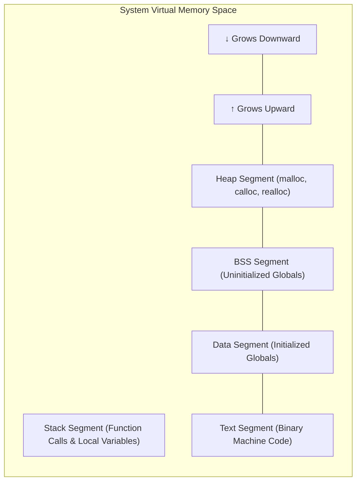

# CHAPTER 12: DYNAMIC MEMORY ALLOCATION (DMA)

[](https://en.cppreference.com/w/c)
[](https://gcc.gnu.org/)
[](https://code.visualstudio.com/)
[](https://git-scm.com/)
[](LICENSE)

> Master runtime heap memory management in C — exploring `malloc()`, `calloc()`, `realloc()`, and `free()` from `<stdlib.h>`, heap vs stack memory architecture, memory leak prevention, dangling pointer mitigation, and 6 practical problem solutions.

---

## Table of Contents

- [What is Dynamic Memory Allocation?](#what-is-dynamic-memory-allocation)
- [Stack vs Heap Memory](#stack-vs-heap-memory)
- [The 4 Core DMA Functions](#the-4-core-dma-functions)
- [1. malloc() - Memory Allocation](#1-malloc---memory-allocation)
- [2. calloc() - Contiguous Allocation](#2-calloc---contiguous-allocation)
- [3. realloc() - Re-Allocation](#3-realloc---re-allocation)
- [4. free() - Memory Deallocation](#4-free---memory-deallocation)
- [Memory Leaks and Dangling Pointers](#memory-leaks-and-dangling-pointers)
- [DMA Memory Layout Architecture](#dma-memory-layout-architecture)
- [Practice Problems and Solutions](#practice-problems-and-solutions)
- [License](#license)

---

## What is Dynamic Memory Allocation?

In static memory allocation (e.g. `int arr[100];`), array sizes must be fixed at compile time and cannot grow or shrink during execution.

**Dynamic Memory Allocation (DMA)** allows your program to request, resize, and release exact amounts of memory on the **Heap** at **runtime** as user needs change.

---

## Stack vs Heap Memory

| Feature | Stack Memory | Heap Memory (DMA) |
| :--- | :--- | :--- |
| **Allocation Time** | Compile time | **Runtime** |
| **Management** | Automatic (pushed/popped on scope exit) | **Manual** (via `malloc` and `free`) |
| **Size Flexibility** | Fixed static size | **Dynamic** (can resize via `realloc`) |
| **Lifespan** | Tied to local function scope | Persists until explicitly `free()`d |
| **Performance** | Extremely fast access | Slightly slower allocation overhead |

---

## The 4 Core DMA Functions

Declared inside `<stdlib.h>`:

```text
┌─────────────────────────────────────────────────────────────┐
│                 The Four Pillar Functions of DMA            │
├────────────────────┬────────────────────────────────────────┤
│ 1. malloc(size)    │ Allocates N bytes (holds garbage data) │
│ 2. calloc(n, size) │ Allocates and zero-initializes memory  │
│ 3. realloc(ptr, sz)│ Resizes existing heap allocation block │
│ 4. free(ptr)       │ Deallocates heap memory back to OS     │
└────────────────────┴────────────────────────────────────────┘
```

---

## 1. malloc() - Memory Allocation

Allocates a contiguous block of bytes on the Heap and returns a generic `void *` pointer.

$$\text{ptr} = (\text{type}*) \ \text{malloc}(\text{count} \times \text{sizeof(type)});$$

```c
#include <stdio.h>
#include <stdlib.h>

int main() {
    int *ptr = (int *)malloc(5 * sizeof(int));
    if (ptr == NULL) {
        printf("Memory allocation failed!\n");
        return 1;
    }

    // Populate array
    for (int i = 0; i < 5; i++) {
        ptr[i] = (i + 1) * 10;
        printf("ptr[%d] = %d\n", i, ptr[i]);
    }

    free(ptr); // Clean up
    return 0;
}
```

---

## 2. calloc() - Contiguous Allocation

Allocates memory for multiple elements and automatically **initializes every byte to zero (`0`)**:

$$\text{ptr} = (\text{type}*) \ \text{calloc}(\text{num\_elements}, \ \text{sizeof(type)});$$

```c
#include <stdio.h>
#include <stdlib.h>

int main() {
    int *ptr = (int *)calloc(5, sizeof(int));
    if (ptr == NULL) {
        printf("Memory allocation failed!\n");
        return 1;
    }

    printf("Values initialized by calloc (all zeros):\n");
    for (int i = 0; i < 5; i++) {
        printf("ptr[%d] = %d\n", i, ptr[i]); // All 0
    }

    free(ptr);
    return 0;
}
```

---

## 3. realloc() - Re-Allocation

Dynamically increases or decreases the capacity of an existing heap memory block without losing existing data:

$$\text{ptr} = (\text{type}*) \ \text{realloc}(\text{ptr}, \ \text{new\_size\_in\_bytes});$$

```c
#include <stdio.h>
#include <stdlib.h>

int main() {
    int *ptr = (int *)malloc(3 * sizeof(int));
    ptr[0] = 10; ptr[1] = 20; ptr[2] = 30;

    // Expand memory to hold 6 integers
    int *newPtr = (int *)realloc(ptr, 6 * sizeof(int));
    if (newPtr == NULL) {
        printf("Reallocation failed!\n");
        free(ptr);
        return 1;
    }
    ptr = newPtr;

    ptr[3] = 40; ptr[4] = 50; ptr[5] = 60;

    for (int i = 0; i < 6; i++) {
        printf("ptr[%d] = %d\n", i, ptr[i]);
    }

    free(ptr);
    return 0;
}
```

---

## 4. free() - Memory Deallocation

Releases heap memory back to the operating system so it can be reallocated elsewhere:

```c
free(ptr);
ptr = NULL; // Best Practice: Clear pointer to prevent dangling references!
```

---

## Memory Leaks and Dangling Pointers

```text
┌─────────────────────────────────────────────────────────────┐
│                 Two Critical Pitfalls in DMA                │
├────────────────────┬────────────────────────────────────────┤
│ 1. Memory Leak     │ Occurs when heap memory is allocated   │
│                    │ but never released via free(). RAM gets│
│                    │ permanently occupied until shutdown.  │
│ 2. Dangling Pointer│ Occurs when a pointer still points to a│
│                    │ memory block after it has been freed.  │
└────────────────────┴────────────────────────────────────────┘
```

---

## DMA Memory Layout Architecture



---

## Practice Problems and Solutions

### Problem 1: Dynamic Array Allocation with malloc()
Write a program to dynamically allocate memory for $N$ integers entered by the user, populate them, and display their sum.

```c
#include <stdio.h>
#include <stdlib.h>

int main() {
    int n, sum = 0;
    printf("Enter number of elements: ");
    scanf("%d", &n);

    int *arr = (int *)malloc(n * sizeof(int));
    if (arr == NULL) {
        printf("Memory allocation failed!\n");
        return 1;
    }

    printf("Enter %d integers:\n", n);
    for (int i = 0; i < n; i++) {
        scanf("%d", &arr[i]);
        sum += arr[i];
    }

    printf("Sum of %d elements = %d\n", n, sum);

    free(arr);
    arr = NULL;
    return 0;
}
```

---

### Problem 2: Zero-Initialized Array with calloc()
Allocate an array of 5 floats using `calloc()`, print their initial values, populate with user input, and print again.

```c
#include <stdio.h>
#include <stdlib.h>

int main() {
    float *prices = (float *)calloc(5, sizeof(float));
    if (prices == NULL) {
        printf("Allocation error!\n");
        return 1;
    }

    printf("Initial values (calloc zero-init):\n");
    for (int i = 0; i < 5; i++) {
        printf("%.2f ", prices[i]);
    }
    printf("\n");

    printf("\nEnter 5 item prices:\n");
    for (int i = 0; i < 5; i++) {
        scanf("%f", &prices[i]);
    }

    printf("\nUpdated Prices:\n");
    for (int i = 0; i < 5; i++) {
        printf("%.2f ", prices[i]);
    }
    printf("\n");

    free(prices);
    prices = NULL;
    return 0;
}
```

---

### Problem 3: Dynamic Array Resizing with realloc()
Allocate memory for 3 integers, then resize to 6 integers and print all 6 values.

```c
#include <stdio.h>
#include <stdlib.h>

int main() {
    int *numbers = (int *)malloc(3 * sizeof(int));
    if (numbers == NULL) return 1;

    numbers[0] = 100;
    numbers[1] = 200;
    numbers[2] = 300;

    printf("Initial 3 numbers: %d, %d, %d\n", numbers[0], numbers[1], numbers[2]);

    // Resize to 6 integers
    int *temp = (int *)realloc(numbers, 6 * sizeof(int));
    if (temp == NULL) {
        free(numbers);
        return 1;
    }
    numbers = temp;

    numbers[3] = 400;
    numbers[4] = 500;
    numbers[5] = 600;

    printf("Resized array with 6 numbers:\n");
    for (int i = 0; i < 6; i++) {
        printf("%d ", numbers[i]);
    }
    printf("\n");

    free(numbers);
    numbers = NULL;
    return 0;
}
```

---

### Problem 4: Dynamic String Allocation
Allocate memory for a dynamic string at runtime, take user input with `fgets()`, and print the string.

```c
#include <stdio.h>
#include <stdlib.h>

int main() {
    int maxLen = 100;
    char *str = (char *)malloc(maxLen * sizeof(char));
    if (str == NULL) {
        printf("Memory allocation failed!\n");
        return 1;
    }

    printf("Enter a message: ");
    fgets(str, maxLen, stdin);

    printf("Dynamic String: %s", str);

    free(str);
    str = NULL;
    return 0;
}
```

---

### Problem 5: Store and Print N Odd Numbers Dynamically
Allocate memory dynamically for the first $N$ odd natural numbers.

```c
#include <stdio.h>
#include <stdlib.h>

int main() {
    int n;
    printf("Enter count of odd numbers: ");
    scanf("%d", &n);

    int *odds = (int *)malloc(n * sizeof(int));
    if (odds == NULL) return 1;

    for (int i = 0; i < n; i++) {
        odds[i] = 2 * i + 1;
    }

    printf("First %d Odd Numbers:\n", n);
    for (int i = 0; i < n; i++) {
        printf("%d ", odds[i]);
    }
    printf("\n");

    free(odds);
    odds = NULL;
    return 0;
}
```

---

### Problem 6: Safe Deallocation and Dangling Pointer Protection
Demonstrate safe allocation, usage, deallocation, and pointer nullification.

```c
#include <stdio.h>
#include <stdlib.h>

void safeClean(int **ptr) {
    if (ptr != NULL && *ptr != NULL) {
        free(*ptr);
        *ptr = NULL; // Nullify to eliminate dangling pointer
        printf("Memory freed and pointer safely set to NULL.\n");
    }
}

int main() {
    int *data = (int *)malloc(5 * sizeof(int));
    if (data == NULL) return 1;

    data[0] = 42;
    printf("Data value: %d\n", data[0]);

    safeClean(&data);

    if (data == NULL) {
        printf("Pointer verified safe: points to NULL.\n");
    }

    return 0;
}
```

---

## License

This project is licensed under the [MIT License](LICENSE).

---

**Made with ❤️ for Beginners** • **Author: Adesh Srivastava (Tanmay)***