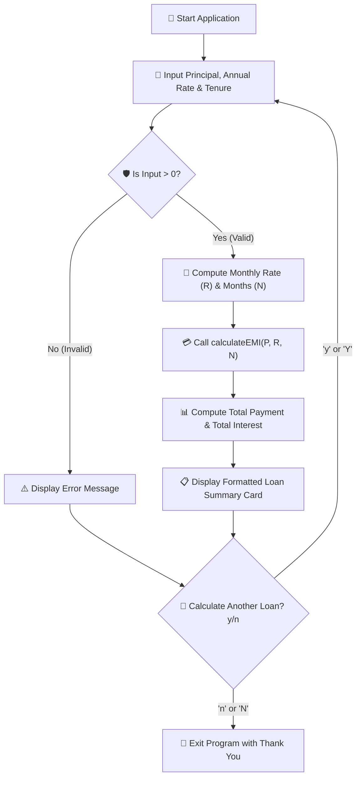

# PROJECT 1 : CREDIT (LOAN) CALCULATOR

[](https://en.cppreference.com/w/c)
[](https://gcc.gnu.org/)
[](https://code.visualstudio.com/)
[](https://git-scm.com/)
[](LICENSE)

> 💳 A beginner-friendly, real-world financial CLI application in C that calculates Monthly EMI (Equated Monthly Installment), Total Payable Amount, and Total Interest for any loan using mathematical power algorithms and robust input validation.

---

## Table of Contents

- [Overview](#overview)
- [Key Features](#key-features)
- [Mathematical Formulation](#mathematical-formulation)
- [Program Architecture](#program-architecture)
- [Complete Source Code](#complete-source-code)
- [Compilation and Execution](#compilation-and-execution)
- [Sample Terminal Run](#sample-terminal-run)
- [Concepts Mastered](#concepts-mastered)
- [License](#license)

---

## Overview

Taking a loan requires calculating the monthly commitment, total repayment value, and interest cost. This **Credit / Loan Calculator** automates standard banking financial computations directly from the terminal with an interactive, repeatable menu.

```text
┌─────────────────────────────────────────────────────────────┐
│                    Loan Calculator Snapshot                 │
├────────────────────┬────────────────────────────────────────
│ 💵 Principal Input │ Rs. 5,00,000                           │
│ 📈 Annual Rate     │ 8.5%                                   │
│ ⏳ Tenure          │ 5 Years (60 Months)                    │
│ 💳 Monthly EMI     │ Rs. 10,258.33                          │
│ 📊 Total Interest  │ Rs. 1,15,500.00                        │
└────────────────────┴────────────────────────────────────────┘
```

---

## Key Features

- 🧮 **Accurate Banking Mathematics**: Uses the industry-standard amortized EMI formula with `<math.h>`.
- 🛡️ **Defensive Input Validation**: Rejects negative or zero values for principal amount, interest rates, and loan tenure.
- 🔄 **Interactive Execution Loop**: Powered by a `do-while` loop allowing continuous calculations without restarting the executable.
- ⚡ **Lightweight & Portable**: Clean standard C code that builds seamlessly across Linux, macOS, and Windows.

---

## Mathematical Formulation

The Equated Monthly Installment (**EMI**) is calculated using the following standard amortized loan formula:

$$\text{EMI} = \frac{P \times R \times (1+R)^N}{(1+R)^N - 1}$$

### Variable Definitions:
- **$P$ (Principal)**: Total original loan amount borrowed.
- **$R$ (Monthly Interest Rate)**: Periodic monthly interest rate converted to decimal:
  $$R = \frac{\text{Annual Interest Rate}}{12 \times 100}$$
- **$N$ (Tenure in Months)**: Total number of monthly installments:
  $$N = \text{Tenure in Years} \times 12$$

### Totals Calculation:
- **Total Repayment Amount**:
  $$\text{Total Amount} = \text{EMI} \times N$$
- **Total Interest Paid**:
  $$\text{Total Interest} = \text{Total Amount} - P$$

---

## Program Architecture



---

## Complete Source Code

```c
/*
 * ============================================================================
 * Project 1: Credit (Loan) Calculator
 * Description: Calculates EMI, Total Amount Payable, and Total Interest
 * Author: Adesh Srivastava (Tanmay)
 * License: MIT License
 * ============================================================================
 */

#include <stdio.h>
#include <math.h> // Required for pow() in EMI calculation

/*
 * Function: calculateEMI
 * ---------------------
 * Calculates the Equated Monthly Installment (EMI) for an amortized loan.
 * Formula: EMI = [P x R x (1+R)^N] / [(1+R)^N - 1]
 *
 * principal   : Principal loan amount (P)
 * monthlyRate : Monthly interest rate as decimal (R)
 * months      : Total tenure in months (N)
 *
 * returns     : Monthly installment amount as float
 */
float calculateEMI(float principal, float monthlyRate, int months) {
    float rateFactor = pow((1 + monthlyRate), months); // (1 + R)^N
    float emi = (principal * monthlyRate * rateFactor) / (rateFactor - 1);
    return emi;
}

int main() {
    float principal;    // Loan amount requested
    float annualRate;   // Annual interest rate (in %)
    int years;          // Loan tenure in years
    char choice;        // Loop continuation flag

    do {
        // -------- Step 1: User Input --------
        printf("\n=========================================\n");
        printf("       💳 Credit / Loan Calculator       \n");
        printf("=========================================\n");

        printf("Enter loan amount (Principal) : Rs. ");
        scanf("%f", &principal);

        printf("Enter annual interest rate (%%) : ");
        scanf("%f", &annualRate);

        printf("Enter loan tenure (Years)     : ");
        scanf("%d", &years);

        // -------- Step 2: Input Validation --------
        if (principal <= 0 || annualRate <= 0 || years <= 0) {
            printf("\n[ERROR] Invalid input! All values must be strictly positive.\n");
        } else {
            // -------- Step 3: Unit Conversions --------
            float monthlyRate = annualRate / (12.0 * 100.0);
            int months = years * 12;

            // -------- Step 4: EMI Computation --------
            float emi = calculateEMI(principal, monthlyRate, months);

            // -------- Step 5: Total Summary --------
            float totalPayment = emi * months;
            float totalInterest = totalPayment - principal;

            // -------- Step 6: Formatted Results --------
            printf("\n-----------------------------------------\n");
            printf("           📊 Loan Summary Card          \n");
            printf("-----------------------------------------\n");
            printf("Monthly EMI       : Rs. %10.2f\n", emi);
            printf("Principal Amount  : Rs. %10.2f\n", principal);
            printf("Total Interest    : Rs. %10.2f\n", totalInterest);
            printf("Total Payment     : Rs. %10.2f\n", totalPayment);
            printf("-----------------------------------------\n");
        }

        // -------- Step 7: Repeat Option --------
        printf("\nCalculate another loan? (y/n): ");
        scanf(" %c", &choice); // Leading space consumes trailing newline

    } while (choice == 'y' || choice == 'Y');

    printf("\nThank you for using the Credit Calculator! Have a great day! 😊\n\n");
    return 0;
}
```

---

## Compilation and Execution

### Using GCC Compiler:

> **Important**: When compiling code that uses `<math.h>` on Linux or GCC, link the math library with `-lm`.

```bash
# 1. Compile with math library flag (-lm)
gcc loan_calculator.c -o loan_calculator -lm

# 2. Run the executable
./loan_calculator
```

### Using Clang Compiler (macOS / Xcode Tools):

```bash
clang loan_calculator.c -o loan_calculator -lm
./loan_calculator
```

---

## Sample Terminal Run

```text
=========================================
       💳 Credit / Loan Calculator       
=========================================
Enter loan amount (Principal) : Rs. 500000
Enter annual interest rate (%) : 8.5
Enter loan tenure (Years)     : 5

-----------------------------------------
           📊 Loan Summary Card          
-----------------------------------------
Monthly EMI       : Rs.   10258.33
Principal Amount  : Rs.  500000.00
Total Interest    : Rs.  115500.00
Total Payment     : Rs.  615500.00
-----------------------------------------

Calculate another loan? (y/n): n

Thank you for using the Credit Calculator! Have a great day! 😊
```

---

## Concepts Mastered

| Concept | Implementation in Project |
| :--- | :--- |
| **Functions & Modularity** | Clean division of computation via `calculateEMI()` |
| **Standard Math Library** | Using `pow()` from `<math.h>` for compound exponential calculations |
| **Data Types & Precision** | Using `float` and format specifiers (`%.2f`) for monetary precision |
| **Flow Control** | Defensive `if-else` verification and interactive `do-while` menu execution |
| **Buffer Management** | Safe input stream reading with whitespace padding (`scanf(" %c")`) |

---

## License

This project is licensed under the [MIT License](LICENSE).

---

**Made with ❤️ for Beginners** • **Author: Adesh Srivastava (Tanmay)**

