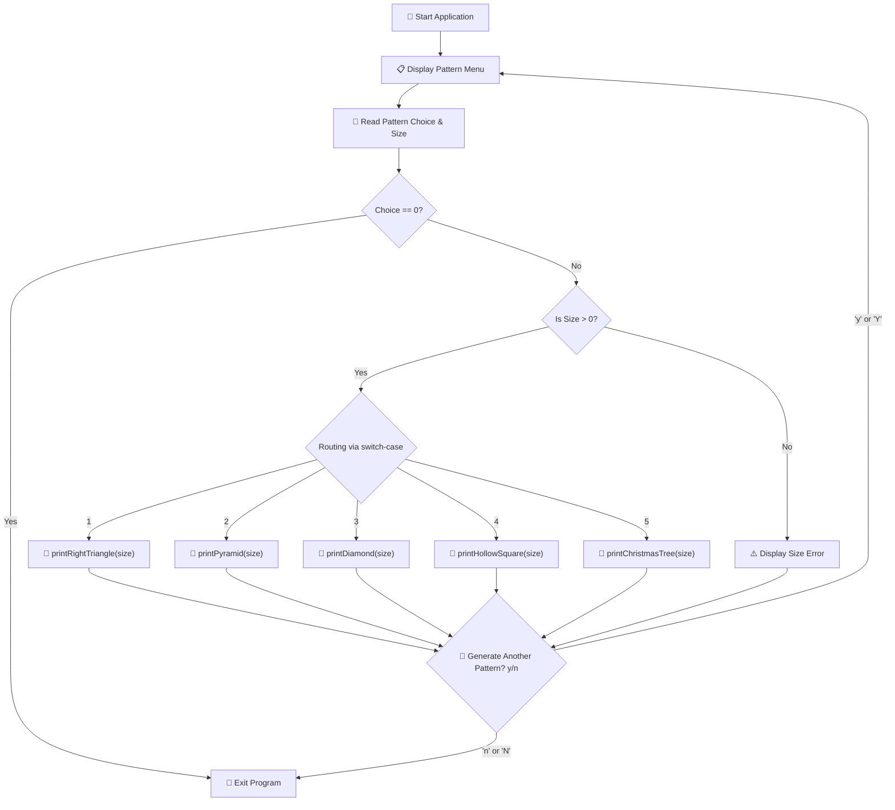

# PROJECT 2: ASCII ART PATTERN GENERATOR

[](https://en.cppreference.com/w/c)
[](https://gcc.gnu.org/)
[](https://code.visualstudio.com/)
[](https://git-scm.com/)
[](LICENSE)

> 🎨 An interactive CLI pattern generator in C that creates geometric ASCII shapes — right triangles, centered pyramids, symmetric diamonds, hollow squares, and Christmas trees using nested loops and algorithmic coordinate logic.

---

## Table of Contents

- [Overview](#overview)
- [Included Patterns](#included-patterns)
- [Pattern Algorithms and Mathematics](#pattern-algorithms-and-mathematics)
- [Program Architecture](#program-architecture)
- [Complete Source Code](#complete-source-code)
- [Compilation and Execution](#compilation-and-execution)
- [Sample Terminal Runs](#sample-terminal-runs)
- [Concepts Mastered](#concepts-mastered)
- [License](#license)

---

## Overview

Pattern generation is the classic benchmark for mastering **nested loop control**, row/column coordinate mapping, and condition branching in C.

This application provides a dynamic terminal menu where users can select from 5 distinct geometric patterns, specify a custom row height, and render real-time ASCII designs.

```text
┌─────────────────────────────────────────────────────────────┐
│                    ASCII Generator Features                 │
├────────────────────┬────────────────────────────────────────┤
│ 📐 Right Triangle  │ Incremental star distribution          │
│ 🔺 Centered Pyramid│ Symmetrical odd-number formula (2i-1)  │
│ 💎 Diamond Shape   │ Bidirectional mirrored top & bottom    │
│ 🔲 Hollow Square   │ 2D matrix perimeter boundary check     │
│ 🌲 Christmas Tree  │ Centered crown with dual trunk base    │
└────────────────────┴────────────────────────────────────────┘
```

---

## Included Patterns

| # | Pattern Name | Key Algorithm | Visual Signature |
| :-: | :--- | :--- | :--- |
| **1** | **Right Triangle** | Row $i$ has $i$ stars | `*`, `* *`, `* * *` |
| **2** | **Pyramid** | $(N - i)$ spaces followed by $(2i - 1)$ stars | Centered triangle |
| **3** | **Diamond** | Pyramid top + mirrored inverted pyramid bottom | Symmetrical diamond |
| **4** | **Hollow Square** | Print stars only on perimeter ($i=1, N$ or $j=1, N$) | Open box |
| **5** | **Christmas Tree** | Full pyramid body with a centered `\|` trunk base | Festive holiday tree |

---

## Pattern Algorithms and Mathematics

### 1. Centered Pyramid Formula
To render a symmetrical pyramid of height $N$:
- **Leading Spaces per Row**: $\text{Spaces} = N - i$
- **Stars per Row**: $\text{Stars} = 2i - 1$ (Produces odd progression: $1, 3, 5, 7, \dots$)

### 2. Symmetrical Diamond Formulation
- **Upper Half ($1 \le i \le N$)**: Standard pyramid formula.
- **Lower Half ($N-1 \ge i \ge 1$)**: Decrementing loop using the exact same space/star ratios.

### 3. Hollow Square Perimeter Logic
For an $N \times N$ matrix grid:
$$\text{Print } '*' \iff (i == 1 \lor i == N \lor j == 1 \lor j == N) \quad \text{else print } ' \ '$$

---

## Program Architecture



---

## Complete Source Code

```c
/*
 * ============================================================================
 * Project 2: ASCII Art Pattern Generator
 * Description: Renders 5 geometric ASCII patterns using nested loops
 * Author: Adesh Srivastava (Tanmay)
 * License: MIT License
 * ============================================================================
 */

#include <stdio.h>

// ---------- Function Prototypes ----------
void printRightTriangle(int rows);
void printPyramid(int rows);
void printDiamond(int rows);
void printHollowSquare(int side);
void printChristmasTree(int rows);

int main() {
    int choice, size;
    char again;

    do {
        // -------- Step 1: Display Interactive Menu --------
        printf("\n=========================================\n");
        printf("       🎨 ASCII Art Pattern Generator    \n");
        printf("=========================================\n");
        printf(" 1. 📐 Right Triangle\n");
        printf(" 2. 🔺 Centered Pyramid\n");
        printf(" 3. 💎 Symmetric Diamond\n");
        printf(" 4. 🔲 Hollow Square\n");
        printf(" 5. 🌲 Christmas Tree\n");
        printf(" 0. 🚪 Exit Program\n");
        printf("-----------------------------------------\n");
        printf("Enter your choice (0-5): ");
        scanf("%d", &choice);

        if (choice == 0) {
            printf("\nThank you for using ASCII Art Generator! Goodbye! 👋\n\n");
            break;
        }

        printf("Enter size (number of rows): ");
        scanf("%d", &size);

        // -------- Step 2: Input Validation --------
        if (size <= 0) {
            printf("\n[ERROR] Size must be a strictly positive integer!\n");
        } else {
            // -------- Step 3: Route to Pattern Function --------
            switch (choice) {
                case 1:
                    printRightTriangle(size);
                    break;
                case 2:
                    printPyramid(size);
                    break;
                case 3:
                    printDiamond(size);
                    break;
                case 4:
                    printHollowSquare(size);
                    break;
                case 5:
                    printChristmasTree(size);
                    break;
                default:
                    printf("\n[ERROR] Invalid choice! Please select between 0 and 5.\n");
            }
        }

        // -------- Step 4: Repeat Option --------
        printf("\nGenerate another pattern? (y/n): ");
        scanf(" %c", &again); // Leading space consumes leftover newline buffer

    } while (again == 'y' || again == 'Y');

    return 0;
}

// ------------------------------------------------------------
// 1. Right Triangle
// ------------------------------------------------------------
void printRightTriangle(int rows) {
    printf("\n--- 📐 Right Triangle (Rows: %d) ---\n", rows);
    for (int i = 1; i <= rows; i++) {
        for (int j = 1; j <= i; j++) {
            printf("* ");
        }
        printf("\n");
    }
}

// ------------------------------------------------------------
// 2. Centered Pyramid
// ------------------------------------------------------------
void printPyramid(int rows) {
    printf("\n--- 🔺 Centered Pyramid (Rows: %d) ---\n", rows);
    for (int i = 1; i <= rows; i++) {
        // Print leading alignment spaces
        for (int space = 1; space <= rows - i; space++) {
            printf(" ");
        }
        // Print odd sequence of stars (2i - 1)
        for (int star = 1; star <= (2 * i - 1); star++) {
            printf("*");
        }
        printf("\n");
    }
}

// ------------------------------------------------------------
// 3. Symmetric Diamond
// ------------------------------------------------------------
void printDiamond(int rows) {
    printf("\n--- 💎 Symmetric Diamond (Rows: %d) ---\n", rows);

    // Top half (Pyramid)
    for (int i = 1; i <= rows; i++) {
        for (int space = 1; space <= rows - i; space++) {
            printf(" ");
        }
        for (int star = 1; star <= (2 * i - 1); star++) {
            printf("*");
        }
        printf("\n");
    }

    // Bottom half (Inverted Pyramid)
    for (int i = rows - 1; i >= 1; i--) {
        for (int space = 1; space <= rows - i; space++) {
            printf(" ");
        }
        for (int star = 1; star <= (2 * i - 1); star++) {
            printf("*");
        }
        printf("\n");
    }
}

// ------------------------------------------------------------
// 4. Hollow Square
// ------------------------------------------------------------
void printHollowSquare(int side) {
    printf("\n--- 🔲 Hollow Square (Side: %d) ---\n", side);
    for (int i = 1; i <= side; i++) {
        for (int j = 1; j <= side; j++) {
            // Boundary condition: top, bottom, left, or right edges
            if (i == 1 || i == side || j == 1 || j == side) {
                printf("* ");
            } else {
                printf("  "); // Empty center
            }
        }
        printf("\n");
    }
}

// ------------------------------------------------------------
// 5. Christmas Tree
// ------------------------------------------------------------
void printChristmasTree(int rows) {
    printf("\n--- 🌲 Christmas Tree (Rows: %d) ---\n", rows);

    // Tree crown (Pyramid body)
    for (int i = 1; i <= rows; i++) {
        for (int space = 1; space <= rows - i; space++) {
            printf(" ");
        }
        for (int star = 1; star <= (2 * i - 1); star++) {
            printf("*");
        }
        printf("\n");
    }

    // Tree trunk (Centered vertical bars)
    for (int t = 1; t <= 2; t++) {
        for (int space = 1; space <= rows - 1; space++) {
            printf(" ");
        }
        printf("|\n");
    }
}
```

---

## Compilation and Execution

### Using GCC Compiler:

```bash
# 1. Compile source code
gcc pattern_generator.c -o pattern_generator

# 2. Execute program
./pattern_generator
```

### Using Clang Compiler (macOS):

```bash
clang pattern_generator.c -o pattern_generator
./pattern_generator
```

---

## Sample Terminal Runs

### 1. Centered Pyramid (`size = 4`):
```text
   *
  ***
 *****
*******
```

### 2. Symmetric Diamond (`size = 4`):
```text
   *
  ***
 *****
*******
 *****
  ***
   *
```

### 3. Hollow Square (`size = 5`):
```text
* * * * * 
*       * 
*       * 
*       * 
* * * * * 
```

### 4. Christmas Tree (`size = 4`):
```text
   *
  ***
 *****
*******
   |
   |
```

---

## Concepts Mastered

| Concept | Implementation in Project |
| :--- | :--- |
| **Nested `for` Loops** | Multi-level row and column coordinate iteration |
| **Space vs Character Ratios** | Computing dynamic horizontal centering using `(rows - i)` |
| **Odd Number Generation** | Producing expanding triangles using `(2 * i - 1)` |
| **2D Perimeter Conditions** | Isolating boundaries (`i == 1 || i == side || j == 1 || j == side`) |
| **Menu Routing** | Clean routing with `switch-case` and function prototypes |

---

## License

This project is licensed under the [MIT License](LICENSE).

---

**Made with ❤️ for Beginners** • **Author: Adesh Srivastava (Tanmay)**
