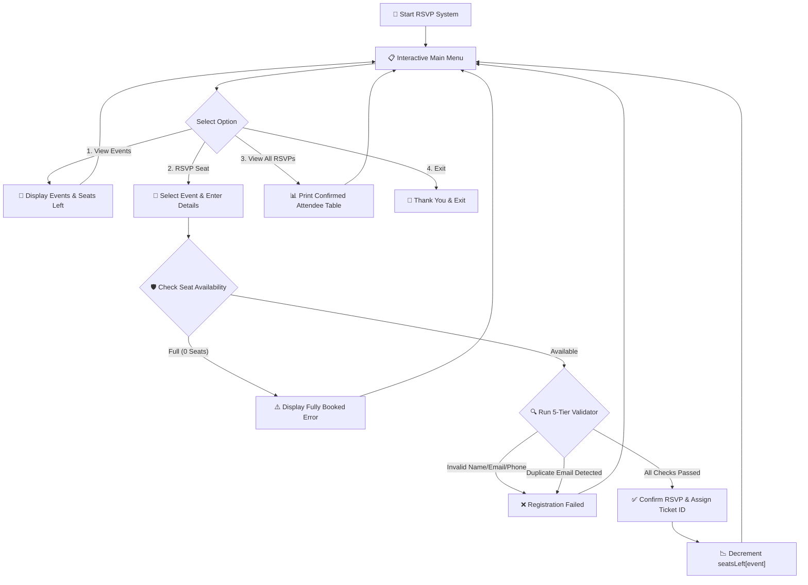

# PROJECT 3 : EVENT RSVP VALIDATOR

[](https://en.cppreference.com/w/c)
[](https://gcc.gnu.org/)
[](https://code.visualstudio.com/)
[](https://git-scm.com/)
[](LICENSE)

> 🎟️ A robust, real-world CLI event registration system in C tailored for Google Developer Community Events (DevFest, Google I/O Extended, Study Jams) — featuring a 5-tier input validation engine, duplicate detection, and dynamic seat inventory tracking.

---

## Table of Contents

- [Overview](#overview)
- [Key Features](#key-features)
- [5-Tier Defensive Validation Engine](#5-tier-defensive-validation-engine)
- [Data Model & Architecture](#data-model--architecture)
- [Program Workflow](#program-workflow)
- [Complete Source Code](#complete-source-code)
- [Compilation and Execution](#compilation-and-execution)
- [Sample Terminal Run](#sample-terminal-run)
- [Concepts Mastered](#concepts-mastered)
- [License](#license)

---

## Overview

Community events like **DevFest** and **Google I/O Extended** require secure, verified attendee registrations. 

This **Event RSVP Validator** demonstrates how to build enterprise-grade CLI validation systems in C — ensuring that every attendee provides valid names, verified email formats, 10-digit phone numbers, and preventing duplicate seat reservations across limited-capacity sessions.

```text
┌─────────────────────────────────────────────────────────────┐
│                 Supported Developer Events                  │
├────────────────────────────┬────────────────────────────────┤
│ 🚀 DevFest 2026            │ 50 Seats Available             │
│ 🌐 Google I/O Extended     │ 30 Seats Available             │
│ 🤖 Android Study Jam       │ 40 Seats Available             │
│ ☁️ Cloud Study Jam         │ 25 Seats Available             │
└────────────────────────────┴────────────────────────────────┘
```

---

## Key Features

- 🛡️ **5-Tier Defensive Validation Engine**: Rigorous verification for names, emails, phone numbers, seat availability, and duplicates.
- 🚫 **Duplicate RSVP Prevention**: Linear scan preventing the same email address from claiming multiple tickets for the same event.
- 🧮 **Live Seat Inventory**: Real-time decrementing seat counters per track.
- 🧹 **Safe Buffer Cleansing**: Eliminates stdin buffer overflow and trailing newlines using `fgets()`, `strcspn()`, and custom stream flushes.
- 📊 **Directory Overview**: Inspect confirmed attendees with unique incremental RSVP Ticket IDs.

---

## 5-Tier Defensive Validation Engine

```text
┌─────────────────────────────────────────────────────────────┐
│                 Five Layers of Input Validation             │
├────────────────────┬────────────────────────────────────────┤
│ 1. Name Check      │ isalpha() + space only. Rejects digits │
│                    │ and special symbols. Non-empty check.  │
│ 2. Email Check     │ Must contain exactly one '@', a '.'    │
│                    │ after '@', and zero whitespace chars.  │
│ 3. Phone Check     │ strlen() == 10 and isdigit() only.     │
│ 4. Seat Allocation │ Verifies seatsLeft[eventIndex] > 0.    │
│ 5. Duplicate Check │ strcmp(email) across existing event ID.│
└────────────────────┴────────────────────────────────────────┘
```

---

## Data Model & Architecture

Each confirmed attendee registration is encapsulated within an `RSVP` structure:

```c
typedef struct {
    int rsvpID;       // Unique Ticket ID (1, 2, 3...)
    char name[50];    // Full verified attendee name
    char email[50];   // Validated email address
    char phone[15];   // 10-Digit contact number
    int eventIndex;   // Foreign key mapping to eventNames[]
} RSVP;
```

---

## Program Workflow



---

## Complete Source Code

```c
/*
 * ============================================================================
 * Project 3: Event RSVP Validator (Google Developer Events)
 * Description: Validates and manages attendee RSVPs for tech conferences
 * Author: Adesh Srivastava (Tanmay)
 * License: MIT License
 * ============================================================================
 */

#include <stdio.h>
#include <string.h>
#include <ctype.h>

#define MAX_EVENTS 4
#define MAX_RSVPS 50

// ---------- Data Model: RSVP Record ----------
typedef struct {
    int rsvpID;
    char name[50];
    char email[50];
    char phone[15];
    int eventIndex; // Foreign key index to eventNames[]
} RSVP;

// ---------- Predefined Event Configurations ----------
char eventNames[MAX_EVENTS][50] = {
    "DevFest 2026",
    "Google I/O Extended",
    "Android Study Jam",
    "Cloud Study Jam"
};

int seatsLeft[MAX_EVENTS] = {50, 30, 40, 25};

// ---------- Function Prototypes ----------
void displayEvents();
int isValidName(char *name);
int isValidEmail(char *email);
int isValidPhone(char *phone);
int isDuplicate(RSVP list[], int count, char *email, int eventIndex);
void registerRSVP(RSVP list[], int *count);
void viewAllRSVPs(RSVP list[], int count);
void clearInputBuffer();

int main() {
    RSVP rsvpList[MAX_RSVPS];
    int rsvpCount = 0;
    int choice;

    do {
        printf("\n===================================================\n");
        printf("    🎟️ Google Developer Event RSVP Validator       \n");
        printf("===================================================\n");
        printf(" 1. 📢 View Available Events & Seats\n");
        printf(" 2. 📝 Register / RSVP for an Event\n");
        printf(" 3. 📊 View All Confirmed RSVPs\n");
        printf(" 4. 🚪 Exit System\n");
        printf("---------------------------------------------------\n");
        printf("Enter your choice (1-4): ");
        scanf("%d", &choice);
        clearInputBuffer(); // Flush newline buffer for subsequent fgets() calls

        switch (choice) {
            case 1:
                displayEvents();
                break;
            case 2:
                registerRSVP(rsvpList, &rsvpCount);
                break;
            case 3:
                viewAllRSVPs(rsvpList, rsvpCount);
                break;
            case 4:
                printf("\nThank you for using the RSVP Validator! See you at the events! 👋\n\n");
                break;
            default:
                printf("\n[ERROR] Invalid option selected! Please try again.\n");
        }

    } while (choice != 4);

    return 0;
}

// ------------------------------------------------------------
// Flushes trailing newline and garbage characters from stdin
// ------------------------------------------------------------
void clearInputBuffer() {
    int c;
    while ((c = getchar()) != '\n' && c != EOF);
}

// ------------------------------------------------------------
// Displays all events with dynamic live seat availability
// ------------------------------------------------------------
void displayEvents() {
    printf("\n---------------- Available Events -----------------\n");
    for (int i = 0; i < MAX_EVENTS; i++) {
        printf(" [%d] %-25s | Seats Remaining: %2d\n", i + 1, eventNames[i], seatsLeft[i]);
    }
    printf("---------------------------------------------------\n");
}

// ------------------------------------------------------------
// Validation 1: Only letters and spaces, non-empty
// ------------------------------------------------------------
int isValidName(char *name) {
    if (strlen(name) == 0) return 0;

    for (int i = 0; name[i] != '\0'; i++) {
        if (!isalpha((unsigned char)name[i]) && name[i] != ' ') {
            return 0; // Found illegal character
        }
    }
    return 1;
}

// ------------------------------------------------------------
// Validation 2: Single '@', a '.' after '@', zero spaces
// ------------------------------------------------------------
int isValidEmail(char *email) {
    char *atSign = strchr(email, '@');
    if (atSign == NULL) return 0; // Missing '@'

    if (strchr(atSign + 1, '@') != NULL) return 0; // Multiple '@' symbols

    char *dot = strchr(atSign, '.');
    if (dot == NULL) return 0; // Missing '.' after '@'

    if (strchr(email, ' ') != NULL) return 0; // Spaces are forbidden

    return 1;
}

// ------------------------------------------------------------
// Validation 3: Exactly 10 numeric digits
// ------------------------------------------------------------
int isValidPhone(char *phone) {
    if (strlen(phone) != 10) return 0;

    for (int i = 0; phone[i] != '\0'; i++) {
        if (!isdigit((unsigned char)phone[i])) return 0;
    }
    return 1;
}

// ------------------------------------------------------------
// Validation 4: Scans for duplicate email for the same event
// ------------------------------------------------------------
int isDuplicate(RSVP list[], int count, char *email, int eventIndex) {
    for (int i = 0; i < count; i++) {
        if (strcmp(list[i].email, email) == 0 && list[i].eventIndex == eventIndex) {
            return 1; // Duplicate detected
        }
    }
    return 0;
}

// ------------------------------------------------------------
// Collects details, executes 5-tier validation, & books seat
// ------------------------------------------------------------
void registerRSVP(RSVP list[], int *count) {
    if (*count >= MAX_RSVPS) {
        printf("\n[ERROR] Total system RSVP capacity reached! Cannot register.\n");
        return;
    }

    char nameInput[50], emailInput[50], phoneInput[15];
    int eventChoice;

    displayEvents();
    printf("Select event number to RSVP (1-%d): ", MAX_EVENTS);
    scanf("%d", &eventChoice);
    clearInputBuffer();

    if (eventChoice < 1 || eventChoice > MAX_EVENTS) {
        printf("\n[ERROR] Invalid event selection.\n");
        return;
    }
    int eventIndex = eventChoice - 1;

    // Check seat availability
    if (seatsLeft[eventIndex] <= 0) {
        printf("\n[ERROR] Sorry! '%s' is completely sold out.\n", eventNames[eventIndex]);
        return;
    }

    printf("\nEnter Attendee Full Name      : ");
    fgets(nameInput, sizeof(nameInput), stdin);
    nameInput[strcspn(nameInput, "\n")] = '\0'; // Remove newline

    printf("Enter Attendee Email Address  : ");
    fgets(emailInput, sizeof(emailInput), stdin);
    emailInput[strcspn(emailInput, "\n")] = '\0';

    printf("Enter 10-Digit Mobile Number  : ");
    fgets(phoneInput, sizeof(phoneInput), stdin);
    phoneInput[strcspn(phoneInput, "\n")] = '\0';

    // -------- Run 5-Tier Defensive Validations --------
    if (!isValidName(nameInput)) {
        printf("\n❌ Registration Failed: Name must contain letters and spaces only.\n");
        return;
    }
    if (!isValidEmail(emailInput)) {
        printf("\n❌ Registration Failed: Invalid email format (e.g. user@domain.com).\n");
        return;
    }
    if (!isValidPhone(phoneInput)) {
        printf("\n❌ Registration Failed: Phone number must be exactly 10 digits.\n");
        return;
    }
    if (isDuplicate(list, *count, emailInput, eventIndex)) {
        printf("\n❌ Registration Failed: This email is already registered for '%s'.\n", eventNames[eventIndex]);
        return;
    }

    // -------- Save Verified RSVP Record --------
    RSVP newRsvp;
    newRsvp.rsvpID = *count + 1;
    strcpy(newRsvp.name, nameInput);
    strcpy(newRsvp.email, emailInput);
    strcpy(newRsvp.phone, phoneInput);
    newRsvp.eventIndex = eventIndex;

    list[*count] = newRsvp;
    (*count)++;
    seatsLeft[eventIndex]--; // Decrement inventory

    printf("\n===================================================\n");
    printf("   🎉 RSVP CONFIRMED! TICKET ID: #GDG-%04d         \n", newRsvp.rsvpID);
    printf("   Event  : %s\n", eventNames[eventIndex]);
    printf("   Name   : %s\n", newRsvp.name);
    printf("   Email  : %s\n", newRsvp.email);
    printf("===================================================\n");
}

// ------------------------------------------------------------
// Prints formatted table of all confirmed RSVPs
// ------------------------------------------------------------
void viewAllRSVPs(RSVP list[], int count) {
    if (count == 0) {
        printf("\n[INFO] No RSVPs registered in the system yet.\n");
        return;
    }

    printf("\n======================== Confirmed Attendee Registry ========================\n");
    printf("%-6s | %-18s | %-22s | %-12s | %-20s\n", "ID", "Name", "Email", "Phone", "Event");
    printf("-----------------------------------------------------------------------------\n");
    for (int i = 0; i < count; i++) {
        printf("#%-5d | %-18s | %-22s | %-12s | %-20s\n",
               list[i].rsvpID, list[i].name, list[i].email,
               list[i].phone, eventNames[list[i].eventIndex]);
    }
    printf("=============================================================================\n");
}
```

---

## Compilation and Execution

### Using GCC Compiler:

```bash
# 1. Compile source code
gcc rsvp_validator.c -o rsvp_validator

# 2. Run application
./rsvp_validator
```

### Using Clang Compiler (macOS):

```bash
clang rsvp_validator.c -o rsvp_validator
./rsvp_validator
```

---

## Sample Terminal Run

```text
===================================================
    🎟️ Google Developer Event RSVP Validator       
===================================================
 1. 📢 View Available Events & Seats
 2. 📝 Register / RSVP for an Event
 3. 📊 View All Confirmed RSVPs
 4. 🚪 Exit System
---------------------------------------------------
Enter your choice (1-4): 2

---------------- Available Events -----------------
 [1] DevFest 2026              | Seats Remaining: 50
 [2] Google I/O Extended       | Seats Remaining: 30
 [3] Android Study Jam         | Seats Remaining: 40
 [4] Cloud Study Jam           | Seats Remaining: 25
---------------------------------------------------
Select event number to RSVP (1-4): 1

Enter Attendee Full Name      : Tanmay Srivastava
Enter Attendee Email Address  : tanmay@devfest.org
Enter 10-Digit Mobile Number  : 9876543210

===================================================
   🎉 RSVP CONFIRMED! TICKET ID: #GDG-0001         
   Event  : DevFest 2026
   Name   : Tanmay Srivastava
   Email  : tanmay@devfest.org
===================================================
```

---

## Concepts Mastered

| Concept | Implementation in Project |
| :--- | :--- |
| **Structures (`struct`)** | Complex record encapsulation with unique IDs |
| **Defensive String Handling** | Safe input using `fgets()`, stripping `\n` via `strcspn()` |
| **Character Class Verification** | `<ctype.h>` inspection using `isalpha()` and `isdigit()` |
| **Search & Traversal** | Pointer string inspection (`strchr()`) and linear duplicate scan (`strcmp()`) |
| **State Mutation by Reference** | Incrementing `*count` and mutating arrays via pointers |

---

## License

This project is licensed under the [MIT License](LICENSE).

---

**Made with ❤️ for Beginners** • **Author: Adesh Srivastava (Tanmay)**