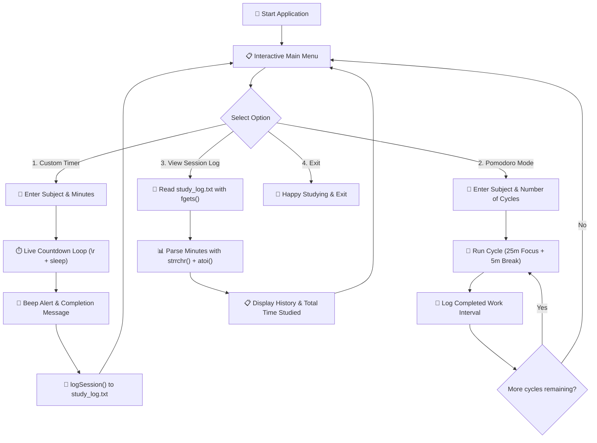

# PROJECT 4 : TERMINAL STUDY TIMER

[](https://en.cppreference.com/w/c)
[](https://gcc.gnu.org/)
[](https://code.visualstudio.com/)
[](https://git-scm.com/)
[](LICENSE)

> ⏱️ A high-productivity CLI study timer in C featuring live in-place countdowns (`\r`), multi-cycle Pomodoro techniques, cross-platform sleep handlers, audio chime notifications, and persistent session logging with total study time analytics.

---

## Table of Contents

- [Overview](#overview)
- [Key Features](#key-features)
- [How It Works](#how-it-works)
- [Program Architecture](#program-architecture)
- [Complete Source Code](#complete-source-code)
- [Compilation and Execution](#compilation-and-execution)
- [Sample Terminal Run](#sample-terminal-run)
- [Concepts Mastered](#concepts-mastered)
- [License](#license)

---

## Overview

Staying focused while studying requires structured time-boxing and accountability.

This **Terminal Study Timer** combines live countdown timers with automated disk-persisted session logging. Whether you are studying data structures for 45 minutes or running 4 cycles of the **Pomodoro Technique** (25 min study / 5 min break), every session is recorded to `study_log.txt` with exact timestamps and durations.

```text
┌─────────────────────────────────────────────────────────────┐
│                   Study Timer Highlights                    │
├────────────────────┬────────────────────────────────────────┤
│ 🎯 Custom Timer    │ Study any subject for custom N minutes │
│ 🍅 Pomodoro Mode   │ Repeated 25m focus + 5m break intervals│
│ 🔄 Dynamic Rewind  │ Single-line terminal countdown (\r)    │
│ 🔔 Audio Chime     │ Terminal bell alert on expiry (\a)     │
│ 📁 File History    │ Persistent disk storage via fopen("a") │
│ 📊 Total Analytics │ Summarizes all lifetime study hours    │
└────────────────────┴────────────────────────────────────────┘
```

---

## Key Features

- 🔄 **Live Single-Line Countdown**: Uses the carriage return escape sequence (`\r`) combined with `fflush(stdout)` to update remaining minutes and seconds in-place without filling the screen with thousands of lines.
- 🍅 **Integrated Pomodoro Engine**: Automates alternating work blocks and restorative micro-breaks across user-defined cycle counts.
- 🌐 **Cross-Platform OS Compatibility**: Seamlessly adapts between Windows `Sleep()` from `<windows.h>` and Unix/macOS `sleep()` from `<unistd.h>` using preprocessor directives.
- 💾 **Persistent Session History**: Writes every completed session to `study_log.txt` using `<time.h>` and `strftime()` formatting.
- 📈 **Lifetime Analytics**: Parses historical logs using string tokenization (`strrchr()` + `atoi()`) to aggregate total completed sessions and total minutes studied.

---

## How It Works

### 1. The Carriage Return (`\r`) Magic
Normally, `printf("\n")` advances the terminal cursor down to a new row. The carriage return `\r` moves the cursor directly back to the **start of the current line**, allowing the timer to overwrite the previous second's timestamp cleanly:

$$\text{printf("\r\%s - Time left: \%02d:\%02d", label, mins, secs);}$$

### 2. Cross-Platform Preprocessor Sleep
```c
#ifdef _WIN32
    #include <windows.h>
    #define SLEEP_SECONDS(x) Sleep((x) * 1000)
#else
    #include <unistd.h>
    #define SLEEP_SECONDS(x) sleep(x)
#endif
```

---

## Program Architecture



---

## Complete Source Code

```c
/*
 * 
 * Project 4: Terminal Study Timer
 * Description: Live CLI countdown timer with Pomodoro mode & file logging
 * Author: Adesh Srivastava (Tanmay)
 * License: MIT License
 * 

#include <stdio.h>
#include <stdlib.h>
#include <string.h>
#include <time.h>

// ---------- Cross-Platform Sleep Compatibility ----------
#ifdef _WIN32
    #include <windows.h>
    #define SLEEP_SECONDS(x) Sleep((x) * 1000)
#else
    #include <unistd.h>
    #define SLEEP_SECONDS(x) sleep(x)
#endif

#define LOG_FILE "study_log.txt"
#define WORK_MINUTES 25
#define BREAK_MINUTES 5

// ---------- Function Prototypes ----------
void showMenu();
void countdown(int totalSeconds, const char *label);
void startCustomTimer();
void startPomodoro();
void logSession(const char *subject, int minutes);
void viewLog();
void clearInputBuffer();

int main() {
    int choice;

    do {
        showMenu();
        scanf("%d", &choice);
        clearInputBuffer(); // Flush newline buffer for subsequent fgets() calls

        switch (choice) {
            case 1:
                startCustomTimer();
                break;
            case 2:
                startPomodoro();
                break;
            case 3:
                viewLog();
                break;
            case 4:
                printf("\nHappy studying! Keep pushing forward! Goodbye! 👋\n\n");
                break;
            default:
                printf("\n[ERROR] Invalid option selected! Please try again.\n");
        }
    } while (choice != 4);

    return 0;
}

// ------------------------------------------------------------
// Displays main dashboard menu
// ------------------------------------------------------------
void showMenu() {
    printf("\n=========================================\n");
    printf("        ⏱️ Terminal Study Timer          \n");
    printf("=========================================\n");
    printf(" 1. 🎯 Custom Timer (Custom Subject & Time)\n");
    printf(" 2. 🍅 Pomodoro Session (25m Focus / 5m Break)\n");
    printf(" 3. 📊 View Lifetime Session Log\n");
    printf(" 4. 🚪 Exit\n");
    printf("-----------------------------------------\n");
    printf("Enter your choice (1-4): ");
}

// ------------------------------------------------------------
// Flushes trailing newline and garbage characters from stdin
// ------------------------------------------------------------
void clearInputBuffer() {
    int c;
    while ((c = getchar()) != '\n' && c != EOF);
}

// ------------------------------------------------------------
// In-place terminal countdown using '\r' and sleep handlers
// ------------------------------------------------------------
void countdown(int totalSeconds, const char *label) {
    for (int remaining = totalSeconds; remaining >= 0; remaining--) {
        int mins = remaining / 60;
        int secs = remaining % 60;

        // '\r' returns the cursor to column 0 to overwrite line
        printf("\r⏳ %s - Time Remaining: %02d:%02d ", label, mins, secs);
        fflush(stdout); // Force immediate terminal buffer render

        if (remaining > 0) {
            SLEEP_SECONDS(1);
        }
    }
    printf("\n");
    printf("\a"); // Terminal bell notification sound
}

// ------------------------------------------------------------
// Appends completed session record to study_log.txt
// ------------------------------------------------------------
void logSession(const char *subject, int minutes) {
    FILE *file = fopen(LOG_FILE, "a"); // Append mode preserves old records
    if (file == NULL) {
        printf("\n[WARNING] Could not save session record to disk.\n");
        return;
    }

    time_t now = time(NULL);
    struct tm *localTime = localtime(&now);
    char timestamp[25];
    strftime(timestamp, sizeof(timestamp), "%Y-%m-%d %H:%M", localTime);

    fprintf(file, "%s | %-20s | %3d min\n", timestamp, subject, minutes);
    fclose(file);
}

// ------------------------------------------------------------
// Executes single custom study session
// ------------------------------------------------------------
void startCustomTimer() {
    char subject[50];
    int minutes;

    printf("\nWhat subject are you studying? : ");
    fgets(subject, sizeof(subject), stdin);
    subject[strcspn(subject, "\n")] = '\0'; // Remove newline

    printf("How many minutes?              : ");
    scanf("%d", &minutes);
    clearInputBuffer();

    if (minutes <= 0) {
        printf("\n[ERROR] Session duration must be greater than 0 minutes.\n");
        return;
    }

    printf("\n🚀 Starting Focus Session for '%s'. Stay Locked In!\n", subject);
    countdown(minutes * 60, subject);

    printf("\n🎉 Session Complete! Great focus on '%s'!\n", subject);
    logSession(subject, minutes);
}

// ------------------------------------------------------------
// Executes multi-cycle Pomodoro workflow
// ------------------------------------------------------------
void startPomodoro() {
    char subject[50];
    int cycles;

    printf("\nWhat subject are you studying? : ");
    fgets(subject, sizeof(subject), stdin);
    subject[strcspn(subject, "\n")] = '\0';

    printf("How many Pomodoro cycles?      : ");
    scanf("%d", &cycles);
    clearInputBuffer();

    if (cycles <= 0) {
        printf("\n[ERROR] Cycle count must be at least 1.\n");
        return;
    }

    for (int i = 1; i <= cycles; i++) {
        printf("\n-----------------------------------------\n");
        printf(" 🍅 Pomodoro Cycle %d of %d: Focus Time  \n", i, cycles);
        printf("-----------------------------------------\n");
        countdown(WORK_MINUTES * 60, "Focus");
        logSession(subject, WORK_MINUTES);

        // Skip break after the final completed cycle
        if (i < cycles) {
            printf("\n-----------------------------------------\n");
            printf(" ☕ Rest Cycle %d of %d: Short Break    \n", i, cycles);
            printf("-----------------------------------------\n");
            countdown(BREAK_MINUTES * 60, "Break");
        }
    }

    printf("\n🏆 All %d Pomodoro cycles completed! Outstanding discipline!\n", cycles);
}

// ------------------------------------------------------------
// Reads history from study_log.txt and calculates total time
// ------------------------------------------------------------
void viewLog() {
    FILE *file = fopen(LOG_FILE, "r");
    if (file == NULL) {
        printf("\n[INFO] No study history found yet. Complete a session to create log!\n");
        return;
    }

    char line[120];
    int totalMinutes = 0;
    int sessionCount = 0;

    printf("\n======================= 📊 Lifetime Study History =======================\n");
    printf("%-16s | %-20s | %-10s\n", "Date & Time", "Subject", "Duration");
    printf("-------------------------------------------------------------------------\n");

    while (fgets(line, sizeof(line), file) != NULL) {
        printf("%s", line);
        sessionCount++;

        // Parse duration: locate last '|' character and extract number
        char *lastPipe = strrchr(line, '|');
        if (lastPipe != NULL) {
            totalMinutes += atoi(lastPipe + 1);
        }
    }
    fclose(file);

    int hours = totalMinutes / 60;
    int remainingMins = totalMinutes % 60;

    printf("=========================================================================\n");
    printf(" Total Completed Sessions : %d\n", sessionCount);
    printf(" Total Study Time Logged  : %d minutes (%d hrs %d mins)\n",
           totalMinutes, hours, remainingMins);
    printf("=========================================================================\n");
}
```

---

## Compilation and Execution

### Using GCC Compiler:

```bash
# 1. Compile source code
gcc study_timer.c -o study_timer

# 2. Run executable
./study_timer
```

### Using Clang Compiler (macOS):

```bash
clang study_timer.c -o study_timer
./study_timer
```

---

## Sample Terminal Run

```text
=========================================
        ⏱️ Terminal Study Timer          
=========================================
 1. 🎯 Custom Timer (Custom Subject & Time)
 2. 🍅 Pomodoro Session (25m Focus / 5m Break)
 3. 📊 View Lifetime Session Log
 4. 🚪 Exit
-----------------------------------------
Enter your choice (1-4): 3

======================= 📊 Lifetime Study History =======================
Date & Time      | Subject              | Duration  
-------------------------------------------------------------------------
2026-08-29 09:30 | Data Structures      |  45 min
2026-08-29 10:45 | Algorithms           |  25 min
2026-08-29 11:15 | Operating Systems    |  25 min
=========================================================================
 Total Completed Sessions : 3
 Total Study Time Logged  : 95 minutes (1 hrs 35 mins)
=========================================================================
```

---

## Concepts Mastered

| Concept | Implementation in Project |
| :--- | :--- |
| **Stream I/O Manipulation** | In-place screen rendering using `\r` and `fflush(stdout)` |
| **Time & Calendar Library** | Timestamp extraction using `<time.h>`, `localtime()`, and `strftime()` |
| **Cross-Platform Preprocessing** | Conditional compilation with `#ifdef _WIN32` for platform-safe sleep |
| **Disk Persistence** | Persistent disk appending (`fopen("a")`) and safe stream reading (`fgets()`) |
| **String Token Parsing** | Reverse character search (`strrchr()`) and string-to-integer conversion (`atoi()`) |

---

## License

This project is licensed under the [MIT License](LICENSE).

---

**Made with ❤️ for Beginners** • **Author: Adesh Srivastava (Tanmay)**