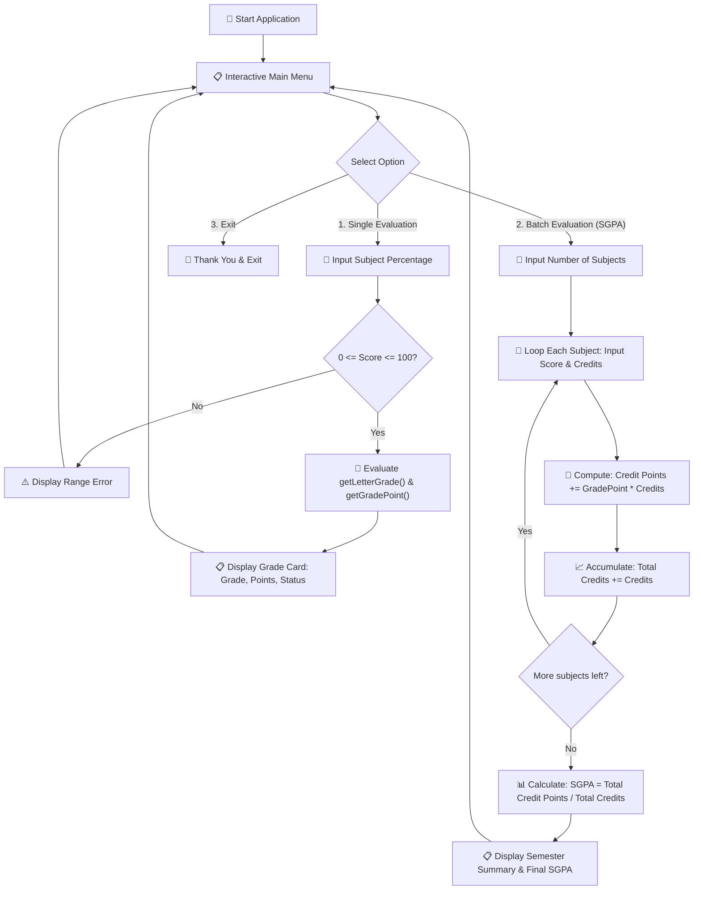

# PROJECT 5: UNIVERSITY GRADE & SGPA CONVERTER

[](https://en.cppreference.com/w/c)
[](https://gcc.gnu.org/)
[](https://code.visualstudio.com/)
[](https://git-scm.com/)
[](LICENSE)

> 🎓 A comprehensive academic grading and SGPA (Semester Grade Point Average) calculator in C — implementing the official UGC 10-point university grading scale with single subject evaluations and credit-weighted multi-course batch processing.

---

## Table of Contents

- [Overview](#overview)
- [Key Features](#key-features)
- [Official 10-Point Grading Scale](#official-10-point-grading-scale)
- [SGPA Mathematical Formulation](#sgpa-mathematical-formulation)
- [Program Architecture](#program-architecture)
- [Complete Source Code](#complete-source-code)
- [Compilation and Execution](#compilation-and-execution)
- [Sample Terminal Run](#sample-terminal-run)
- [Concepts Mastered](#concepts-mastered)
- [License](#license)

---

## Overview

Calculating semester grade point averages manually across multiple courses with varying credit weights is tedious and error-prone.

This **Grade & SGPA Converter** provides an automated academic calculation tool. It allows students and educators to instantly convert raw percentage scores into standardized letter grades and compute official credit-weighted **SGPA** metrics.

```text
┌─────────────────────────────────────────────────────────────┐
│                    Grade Converter Snapshot                 │
├────────────────────┬────────────────────────────────────────┤
│ 🎯 Single Mode     │ Percentage ➔ Letter Grade + Grade Point│
│ 📊 Batch Mode      │ N Subjects ➔ Credit-Weighted SGPA      │
│ 🏅 Scale Standard  │ UGC Indian 10-Point University System  │
│ 🛡️ Fault Tolerance │ Gracefully skips corrupt / invalid rows│
└────────────────────┴────────────────────────────────────────┘
```

---

## Key Features

- 🏅 **Standard 10-Point UGC Grading**: Pre-configured with the standard 8-tier grade distribution (`O`, `A+`, `A`, `B+`, `B`, `C`, `P`, `F`).
- 🧮 **Credit-Weighted SGPA Formula**: Dynamically computes weighted averages taking variable course credits into account.
- 🛡️ **Defensive Entry Validation**: Validates percentage boundaries ($0 \le \text{Percentage} \le 100$) and strictly positive credit values.
- 🔄 **Interactive CLI Architecture**: Modular design separating individual subject lookups from semester-wide matrix evaluations.

---

## Official 10-Point Grading Scale

| Percentage Range | Letter Grade | Qualitative Description | Grade Point ($G_i$) | Status |
| :--- | :--- | :--- | :---: | :---: |
| **$90\% - 100\%$** | **O** | Outstanding | **10** | **PASS** |
| **$80\% - 89\%$** | **A+** | Excellent | **9** | **PASS** |
| **$70\% - 79\%$** | **A** | Very Good | **8** | **PASS** |
| **$60\% - 69\%$** | **B+** | Good | **7** | **PASS** |
| **$50\% - 59\%$** | **B** | Above Average | **6** | **PASS** |
| **$45\% - 49\%$** | **C** | Average | **5** | **PASS** |
| **$40\% - 44\%$** | **P** | Pass | **4** | **PASS** |
| **Below $40\%$** | **F** | Fail | **0** | **FAIL** |

---

## SGPA Mathematical Formulation

The Semester Grade Point Average (**SGPA**) represents the ratio of total grade points earned to the total number of registered credits:

$$\text{SGPA} = \frac{\sum_{i=1}^{n} (G_i \times C_i)}{\sum_{i=1}^{n} C_i}$$

### Variable Definitions:
- **$n$**: Total number of evaluated subjects.
- **$G_i$**: Numeric grade point ($0 - 10$) scored in the $i$-th subject.
- **$C_i$**: Credit weight allocated to the $i$-th subject.
- **$\sum (G_i \times C_i)$**: Total credit points accumulated.
- **$\sum C_i$**: Total course credits registered.

---

## Program Architecture



---

## Complete Source Code

```c
/*
 * ============================================================================
 * Project 5: Grade & SGPA Converter
 * Description: Evaluates letter grades and credit-weighted SGPA on 10-point scale
 * Author: Adesh Srivastava (Tanmay)
 * License: MIT License
 * ============================================================================
 */

#include <stdio.h>

#define MAX_SUBJECTS 20

// ---------- Function Prototypes ----------
const char* getLetterGrade(float percentage);
int getGradePoint(float percentage);
int isPassing(float percentage);
int isValidPercentage(float percentage);
void convertSingle();
void convertBatch();

int main() {
    int choice;

    do {
        printf("\n=========================================\n");
        printf("    🎓 University Grade & SGPA Converter \n");
        printf("=========================================\n");
        printf(" 1. 🎯 Convert a Single Percentage\n");
        printf(" 2. 📊 Batch Evaluate Multiple Subjects (SGPA)\n");
        printf(" 3. 🚪 Exit Program\n");
        printf("-----------------------------------------\n");
        printf("Enter your choice (1-3): ");
        scanf("%d", &choice);

        switch (choice) {
            case 1:
                convertSingle();
                break;
            case 2:
                convertBatch();
                break;
            case 3:
                printf("\nThank you for using the Grade Converter! Best wishes! 👋\n\n");
                break;
            default:
                printf("\n[ERROR] Invalid choice! Please select 1, 2, or 3.\n");
        }
    } while (choice != 3);

    return 0;
}

// ------------------------------------------------------------
// Maps raw percentage to official 10-point scale letter grade
// ------------------------------------------------------------
const char* getLetterGrade(float percentage) {
    if (percentage >= 90.0) return "O";
    else if (percentage >= 80.0) return "A+";
    else if (percentage >= 70.0) return "A";
    else if (percentage >= 60.0) return "B+";
    else if (percentage >= 50.0) return "B";
    else if (percentage >= 45.0) return "C";
    else if (percentage >= 40.0) return "P";
    else return "F";
}

// ------------------------------------------------------------
// Returns numeric grade point (0-10) for SGPA calculations
// ------------------------------------------------------------
int getGradePoint(float percentage) {
    if (percentage >= 90.0) return 10;
    else if (percentage >= 80.0) return 9;
    else if (percentage >= 70.0) return 8;
    else if (percentage >= 60.0) return 7;
    else if (percentage >= 50.0) return 6;
    else if (percentage >= 45.0) return 5;
    else if (percentage >= 40.0) return 4;
    else return 0;
}

// ------------------------------------------------------------
// Checks if score meets minimum passing threshold (40%)
// ------------------------------------------------------------
int isPassing(float percentage) {
    return percentage >= 40.0;
}

// ------------------------------------------------------------
// Validates percentage boundary between 0.0 and 100.0
// ------------------------------------------------------------
int isValidPercentage(float percentage) {
    return (percentage >= 0.0 && percentage <= 100.0);
}

// ------------------------------------------------------------
// Evaluates single course percentage
// ------------------------------------------------------------
void convertSingle() {
    float percentage;

    printf("\nEnter marks percentage (0.0 - 100.0): ");
    scanf("%f", &percentage);

    if (!isValidPercentage(percentage)) {
        printf("\n[ERROR] Invalid percentage! Score must be between 0 and 100.\n");
        return;
    }

    printf("\n-----------------------------------------\n");
    printf("           📋 Grade Evaluation Card      \n");
    printf("-----------------------------------------\n");
    printf(" Marks Percentage : %6.2f%%\n", percentage);
    printf(" Letter Grade     : %s\n", getLetterGrade(percentage));
    printf(" Grade Point      : %d / 10\n", getGradePoint(percentage));
    printf(" Status           : %s\n", isPassing(percentage) ? "✅ PASS" : "❌ FAIL");
    printf("-----------------------------------------\n");
}

// ------------------------------------------------------------
// Evaluates multi-subject batch and computes credit-weighted SGPA
// ------------------------------------------------------------
void convertBatch() {
    int numSubjects;

    printf("\nHow many subjects this semester? (1-%d): ", MAX_SUBJECTS);
    scanf("%d", &numSubjects);

    if (numSubjects <= 0 || numSubjects > MAX_SUBJECTS) {
        printf("\n[ERROR] Subject count must be between 1 and %d.\n", MAX_SUBJECTS);
        return;
    }

    float percentages[MAX_SUBJECTS];
    int credits[MAX_SUBJECTS];
    float totalCreditPoints = 0.0;
    int totalCredits = 0;

    for (int i = 0; i < numSubjects; i++) {
        printf("\n--- Subject %d ---\n", i + 1);

        printf("  Enter Percentage (%%) : ");
        scanf("%f", &percentages[i]);

        printf("  Enter Course Credits  : ");
        scanf("%d", &credits[i]);

        // Defensive verification
        if (!isValidPercentage(percentages[i]) || credits[i] <= 0) {
            printf("  [WARNING] Invalid percentage or credits! Skipping Subject %d.\n", i + 1);
            continue;
        }

        int gradePoint = getGradePoint(percentages[i]);
        printf("  -> Grade: %-2s | Grade Point: %2d\n", getLetterGrade(percentages[i]), gradePoint);

        totalCreditPoints += (gradePoint * credits[i]);
        totalCredits += credits[i];
    }

    printf("\n=========================================\n");
    printf("         📊 Semester SGPA Summary        \n");
    printf("=========================================\n");
    if (totalCredits > 0) {
        float sgpa = totalCreditPoints / totalCredits;
        printf(" Total Course Credits Registered : %d\n", totalCredits);
        printf(" Total Credit Points Earned      : %.2f\n", totalCreditPoints);
        printf(" Final Semester SGPA             : %.2f / 10.00\n", sgpa);
    } else {
        printf(" [ERROR] No valid subjects were recorded to calculate SGPA.\n");
    }
    printf("=========================================\n");
}
```

---

## Compilation and Execution

### Using GCC Compiler:

```bash
# 1. Compile source code
gcc grade_converter.c -o grade_converter

# 2. Run application
./grade_converter
```

### Using Clang Compiler (macOS):

```bash
clang grade_converter.c -o grade_converter
./grade_converter
```

---

## Sample Terminal Run

```text
=========================================
    🎓 University Grade & SGPA Converter 
=========================================
 1. 🎯 Convert a Single Percentage
 2. 📊 Batch Evaluate Multiple Subjects (SGPA)
 3. 🚪 Exit Program
-----------------------------------------
Enter your choice (1-3): 2

How many subjects this semester? (1-20): 3

--- Subject 1 ---
  Enter Percentage (%) : 86.5
  Enter Course Credits  : 4
  -> Grade: A+ | Grade Point:  9

--- Subject 2 ---
  Enter Percentage (%) : 74.0
  Enter Course Credits  : 3
  -> Grade: A  | Grade Point:  8

--- Subject 3 ---
  Enter Percentage (%) : 92.0
  Enter Course Credits  : 4
  -> Grade: O  | Grade Point: 10

=========================================
         📊 Semester SGPA Summary        
=========================================
 Total Course Credits Registered : 11
 Total Credit Points Earned      : 100.00
 Final Semester SGPA             : 9.09 / 10.00
=========================================
```

---

## Concepts Mastered

| Concept | Implementation in Project |
| :--- | :--- |
| **Cascading `if-else` Ladders** | Ordered bracket evaluations mapping continuous percentages to discrete grades |
| **Statistical Weighting Algorithms** | Credit-weighted numerator and denominator aggregation |
| **Constants & Macros** | Bound checking with `#define MAX_SUBJECTS 20` |
| **Array Data Structures** | Tracking parallel vectors (`percentages[]`, `credits[]`) |
| **Defensive Skipping Logic** | Ignoring corrupted inputs with `continue` while protecting summation totals |

---

## License

This project is licensed under the [MIT License](LICENSE).

---

**Made with ❤️ for Beginners** • **Author: Adesh Srivastava (Tanmay)**