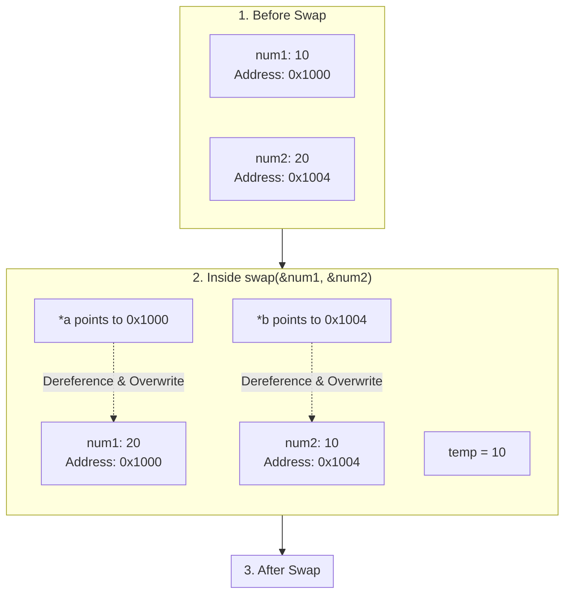

# PROJECT 6: POINTE SWAPPERDtps://img.shields.io/badge/License-MIT-2ea44f?style=for-the-badge)](LICENSE)

> 🔄 An interactive educational CLI tool in C demonstrating in-place memory variable swapping via pointers — mastering Pass-by-Reference, address-of (`&`) and dereference (`*`) operators, hexadecimal address inspection (`%p`), and the algorithmic foundation of sorting algorithms.

---

## Table of Contents

- [Overview](#overview)
- [Why Pointer Swapping Matters](#why-pointer-swapping-matters)
- [Pass-by-Value vs Pass-by-Reference](#pass-by-value-vs-pass-by-reference)
- [The 3-Step Swap Mechanics](#the-3-step-swap-mechanics)
- [Memory Layout & Address Preservation](#memory-layout--address-preservation)
- [Complete Source Code](#complete-source-code)
- [Compilation and Execution](#compilation-and-execution)
- [Sample Terminal Run](#sample-terminal-run)
- [Concepts Mastered](#concepts-mastered)
- [License](#license)

---

## Overview

Swapping the values of two variables is the single most fundamental building block in computer science.

In standard C functions, parameters are passed **by value** (a copy is created), making it impossible for a function to alter variables belonging to its caller. This project demonstrates how **Pointers** and **Pass-by-Reference** bridge this gap by passing memory addresses directly.

```text
┌─────────────────────────────────────────────────────────────┐
│                   Pointer Swapper Snapshot                  │
├────────────────────┬────────────────────────────────────────┤
│ 📍 Address of num1 │ 0x7ffee3b4a8ac (Holds value: 25)       │
│ 📍 Address of num2 │ 0x7ffee3b4a8a8 (Holds value: 80)       │
│ 🔄 Swap Execution  │ swap(&num1, &num2) via Call-by-Ref     │
│ ✨ Result          │ num1 becomes 80, num2 becomes 25       │
│ 🛡️ Memory State   │ Memory addresses remain identical!     │
└────────────────────┴────────────────────────────────────────┘
```

---

## Why Pointer Swapping Matters

In Data Structures and Algorithms (DSA), swapping without allocating extra memory structures is essential:

- 📊 **Sorting Algorithms**: Bubble Sort, Selection Sort, QuickSort partition pivots, and HeapSort heapify steps rely on pointer swapping.
- 🌳 **Tree Rotations**: AVL trees and Red-Black trees rebalance branches by swapping child and parent pointers.
- ⛓️ **Linked Lists & Graphs**: Node rearrangements, reverse traversals, and topological orderings manipulate node pointers in-place.

---

## Pass-by-Value vs Pass-by-Reference

| Feature | Pass-by-Value (`swap(a, b)`) | Pass-by-Reference (`swap(&a, &b)`) |
| :--- | :--- | :--- |
| **Data Passed** | Clones a copy of the numbers | **Passes memory addresses (`&num`)** |
| **Stack Allocation** | New local variables created on stack frame | Pointer variables pointing to caller's stack frame |
| **Caller Impact** | **Zero effect** on original caller variables | **Direct in-place modification** of caller memory |
| **Pointer Operators** | None | Address-of (`&`) and Dereference (`*`) |

---

## The 3-Step Swap Mechanics

Attempting to swap with `a = b; b = a;` destroys the original value of `a`. A temporary buffer variable (`temp`) preserves data across memory transfers:

```text
Initial State:  num1 = [ 10 ]   num2 = [ 20 ]

Step 1: temp = *a;      ==>  temp = 10
Step 2: *a   = *b;      ==>  num1 = 20
Step 3: *b   = temp;    ==>  num2 = 10

Final State:    num1 = [ 20 ]   num2 = [ 10 ]
```

---

## Memory Layout & Address Preservation



---

## Complete Source Code

```c
/*
 * ============================================================================
 * Project 6: Pointer Swapper
 * Description: Swaps two integer variables in-place using pointers
 * Author: Adesh Srivastava (Tanmay)
 * License: MIT License
 * ============================================================================
 */

#include <stdio.h>

/*
 * Function: swap
 * -------------
 * Swaps the values of two integers using their memory addresses.
 *
 * *a : Pointer to the first integer
 * *b : Pointer to the second integer
 */
void swap(int *a, int *b) {
    // Dereference pointer *a to read the caller's actual value
    int temp = *a; // Step 1: Cache value of *a into temp
    *a = *b;       // Step 2: Overwrite *a with value from *b
    *b = temp;     // Step 3: Assign cached temp value into *b
}

int main() {
    int num1, num2;

    printf("\n===================================================\n");
    printf("        🔄 Pointer Swapper Demo in C               \n");
    printf("===================================================\n\n");

    printf("INPUT CONSTRAINTS & GUIDELINES:\n");
    printf(" - Data Type       : 32-bit signed integer (4 Bytes)\n");
    printf(" - Allowed Range   : -2,147,483,648 to +2,147,483,647\n");
    printf(" - Recommended     : Whole numbers between -1000 and 1000\n\n");

    // -------- Step 1: User Input --------
    printf("Enter first integer  (num1): ");
    scanf("%d", &num1);

    printf("Enter second integer (num2): ");
    scanf("%d", &num2);

    // -------- Step 2: Display State Before Swap --------
    printf("\n---------------- BEFORE SWAP ----------------------\n");
    printf(" num1 Value   : %d\n", num1);
    printf(" num2 Value   : %d\n", num2);
    printf(" num1 Address : %p\n", (void *)&num1);
    printf(" num2 Address : %p\n", (void *)&num2);
    printf("---------------------------------------------------\n");

    // -------- Step 3: Execute Pointer Swap --------
    printf("\n[Executing: swap(&num1, &num2) via Call-by-Reference...]\n");
    swap(&num1, &num2);

    // -------- Step 4: Display State After Swap --------
    printf("\n----------------- AFTER SWAP ----------------------\n");
    printf(" num1 Value   : %d  (Swapped!)\n", num1);
    printf(" num2 Value   : %d  (Swapped!)\n", num2);
    printf(" num1 Address : %p  (Unchanged!)\n", (void *)&num1);
    printf(" num2 Address : %p  (Unchanged!)\n", (void *)&num2);
    printf("---------------------------------------------------\n");

    printf("\n💡 KEY TAKEAWAY:\n");
    printf(" Notice that the memory addresses of num1 and num2 remained\n");
    printf(" completely unchanged — only the values residing inside those\n");
    printf(" memory slots were swapped!\n\n");

    return 0;
}
```

---

## Compilation and Execution

### Using GCC Compiler:

```bash
# 1. Compile source code
gcc pointer_swapper.c -o pointer_swapper

# 2. Run executable
./pointer_swapper
```

### Using Clang Compiler (macOS):

```bash
clang pointer_swapper.c -o pointer_swapper
./pointer_swapper
```

---

## Sample Terminal Run

```text
===================================================
        🔄 Pointer Swapper Demo in C               
===================================================

INPUT CONSTRAINTS & GUIDELINES:
 - Data Type       : 32-bit signed integer (4 Bytes)
 - Allowed Range   : -2,147,483,648 to +2,147,483,647
 - Recommended     : Whole numbers between -1000 and 1000

Enter first integer  (num1): 45
Enter second integer (num2): 99

---------------- BEFORE SWAP ----------------------
 num1 Value   : 45
 num2 Value   : 99
 num1 Address : 0x7ffee3b4a8ac
 num2 Address : 0x7ffee3b4a8a8
---------------------------------------------------

[Executing: swap(&num1, &num2) via Call-by-Reference...]

----------------- AFTER SWAP ----------------------
 num1 Value   : 99  (Swapped!)
 num2 Value   : 45  (Swapped!)
 num1 Address : 0x7ffee3b4a8ac  (Unchanged!)
 num2 Address : 0x7ffee3b4a8a8  (Unchanged!)
---------------------------------------------------

💡 KEY TAKEAWAY:
 Notice that the memory addresses of num1 and num2 remained
 completely unchanged — only the values residing inside those
 memory slots were swapped!
```

---

## Concepts Mastered

| Concept | Implementation in Project |
| :--- | :--- |
| **Pointer Types (`int *`)** | Declaring variables that store memory addresses |
| **Address-of Operator (`&`)** | Extracting hexadecimal physical memory locations |
| **Dereferencing (`*`)** | Accessing and mutating caller data through pointer targets |
| **Hexadecimal Format (`%p`)** | Printing pointer memory addresses with `(void *)` cast |
| **In-Place DSA Algorithms** | Swapping data without duplicating array or object instances |

---

## License

This project is licensed under the [MIT License](LICENSE).

---

**Made with ❤️ for Beginners** • **Author: Adesh Srivastava (Tanmay)**