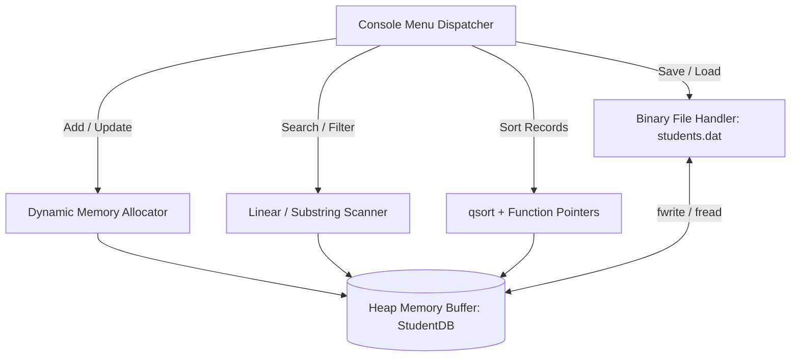

<div align="center">

```
  ____  _             _            _     ____             __ _ _      
 / ___|| |_ _   _  __| | ___ _ __ | |_  |  _ \ _ __ ___  / _(_) | ___ 
 \___ \| __| | | |/ _` |/ _ \ '_ \| __| | |_) | '__/ _ \| |_| | |/ _ \
  ___) | |_| |_| | (_| |  __/ | | | |_  |  __/| | | (_) |  _| | |  __/
 |____/ \__|\__,_|\__,_|\___|_| |_|\__| |_|   |_|  \___/|_| |_|_|\___|
                   M A N A G E M E N T   S Y S T E M
```

### ⚡ *A Modular, Production-Grade C Program Demonstrating Real-World Systems Design*

[](https://en.wikipedia.org/wiki/C_(programming_language))
[](https://code.visualstudio.com/)
[](#)
[](#-license)

---

<p align="center">
  <a href="#-about-the-project">About</a> •
  <a href="#-key-features">Key Features</a> •
  <a href="#-architecture--data-flow">Architecture</a> •
  <a href="#-how-to-compile--run">How to Run</a> •
  <a href="#-core-c-concepts-covered">Core Concepts</a> •
  <a href="#-viva--exam-quick-notes">Viva Cheat Sheet</a>
</p>

</div>

---

## 🌟 About This advance Project

Most academic C projects use fixed-size static arrays (`Student s[50]`), brittle `scanf()` calls that crash on spaces, and lack persistent storage. 

This **Student Profile Management System** bridges the gap between introductory textbook C and real-world systems programming. It implements a **dynamic memory vector** (auto-growing heap array), **generic function pointer comparators (`qsort`)**, **binary serialization for zero data loss**, and **bulletproof input sanitization**.

---

## 🚀 Key Features

<table>
  <tr>
    <td width="50%">
      <h3>📈 Dynamic Memory Vector</h3>
      <p>Zero arbitrary limits! The internal storage automatically doubles its capacity using <code>realloc()</code> whenever needed, giving <strong>O(1) amortized insertion</strong>.</p>
    </td>
    <td width="50%">
      <h3>🛡️ Bulletproof Input Validation</h3>
      <p>Clean buffer flushing and bounds-checking ensure the program <strong>never crashes</strong>, loops infinitely, or misbehaves on invalid user input or EOF signals.</p>
    </td>
  </tr>
  <tr>
    <td width="50%">
      <h3>🗄️ Binary File Persistence</h3>
      <p>Direct bitstream serialization via <code>fwrite()</code> & <code>fread()</code>. Stored data survives across reboots in an efficient binary format (<code>students.dat</code>).</p>
    </td>
    <td width="50%">
      <h3>🎛️ Function Pointer Sorting</h3>
      <p>Leverages standard C library <code>qsort()</code> with custom comparator functions for instantaneous multi-criteria sorting (by CGPA or Alphabetical).</p>
    </td>
  </tr>
  <tr>
    <td width="50%">
      <h3>🔍 Case-Insensitive Search</h3>
      <p>Instant lookup by unique student ID or fuzzy substring matching across student names without relying on non-standard POSIX extensions.</p>
    </td>
    <td width="50%">
      <h3>🎨 Visual ASCII Profile Cards</h3>
      <p>Generates clean, terminal-rendered ID cards with dynamic alignment for individual student reports and academic score breakdowns.</p>
    </td>
  </tr>
</table>

---

## 📸 Sample Visual Output

### 🪪 Student Profile Card
```text
+----------------------------------------------+
|             STUDENT PROFILE CARD             |
+----------------------------------------------+
| ID           : 1001                          |
| Name         : Alex Rivera                   |
| Degree       : BCA                           |
| Enroll. Year : 2026                          |
| Semester     : 1                             |
| CGPA         : 9.24                          |
+----------------------------------------------+
| Subject-wise Marks:                          |
|   C Programming            :  92.50          |
|   Mathematics              :  88.00          |
|   Computer Fundamentals    :  95.00          |
|   Technical Communication  :  85.00          |
|   Web Programming          :  90.00          |
|   Environmental Science    :  76.00          |
+----------------------------------------------+
```

---

## 🏗️ Architecture & Data Flow



---

## 💻 How to Compile & Run

### 📋 Prerequisites
* A standard C compiler (**Clang** / **Apple Clang** on macOS or **GCC**)
* Terminal / Command Prompt or **VS Code Integrated Terminal**

### ⚙️ Compilation

```bash
# Compile using standard C99/C11 flags with all warnings enabled
clang -Wall -Wextra -std=c99 main.c -o student_system
# or with GCC:
gcc -Wall -Wextra -std=c99 main.c -o student_system
```

### ▶️ Execution

```bash
# Run executable
./student_system
```

---

## 🧠 Core C Concepts Covered

| Concept | Implementation in Code |
| :--- | :--- |
| **Structures (`struct`)** | Used to model `Student` records and the database container `StudentDB`. |
| **Enums (`enum`)** | `DegreeType` gives readable named constants to degree programs (`BCA`, `BTECH`, etc.). |
| **Dynamic Memory** | `malloc()` for initialization, `realloc()` for doubling capacity, and `free()` to prevent leaks. |
| **Input Buffer Sanitization** | `clearInputBuffer()` loop with `getchar()` to flush leftover `\n` characters before `fgets()`. |
| **Function Pointers** | Passed custom comparators (`compareByCGPADesc`, `compareByNameAsc`) into `qsort()`. |
| **Binary I/O** | `fopen(..., "wb"/"rb")` paired with `fwrite()` & `fread()` for high-performance persistence. |

---

## 🎯 Viva & Exam Quick Notes

> [!TIP]
> **Why double the capacity during `realloc()` instead of adding +1 each time?**  
> Incrementing capacity by 1 requires an $O(n)$ copy operation on *every single insertion*. Doubling the capacity results in **$O(1)$ amortized time**, making insertions significantly faster.

> [!NOTE]
> **Why use `fgets()` instead of `scanf("%s")` for reading strings?**  
> `scanf("%s")` stops reading at the first whitespace character (breaking names like `"John Doe"`), and can cause severe **buffer overflow** security vulnerabilities. `fgets()` safely reads full lines including spaces up to a specified buffer limit.

> [!IMPORTANT]
> **Why write binary files (`wb`/`rb`) instead of text (`w`/`r`)?**  
> Binary files dump raw memory structs directly to disk in a single instruction (`fwrite`), eliminating slow text parsing and saving storage space.

---

## 📂 Project Structure

```bash
student-profile-management/
│
├── main.c              # Complete modular source code with full documentation
├── students.dat        # Auto-generated binary database file (created on runtime)
└── README.md           # Project documentation and guide
```

---

## 🤝 Contributing

Contributions, bug reports, and feature requests are welcome!  
Feel free to check the [issues page](../../issues) if you'd like to suggest enhancements.

---

<div align="center">

### 📜 License
Distributed under the **MIT License**.

<br />

---

### Crafted with ❤️ & passion for clean C programming by

## **[ADESH(TANMAY) / tanmay119-pera]**

[](https://github.com/)
[](https://en.wikipedia.org/wiki/C_(programming_language))
[](https://code.visualstudio.com/)
[](#)

*“Bad programmers worry about the code. Good programmers worry about data structures and their relationships.”* — **Linus Torvalds**

</div>