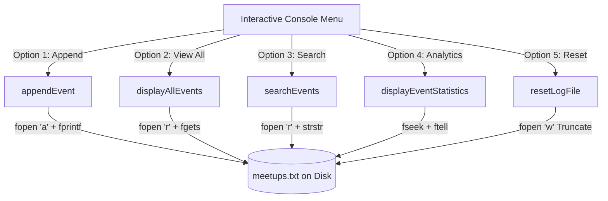

<div align="center">

```
  __  __           _               _                 
 |  \/  | ___  ___| |_ _   _ _ __ | |    ___   __ _  
 | |\/| |/ _ \/ _ \ __| | | | '_ \| |   / _ \ / _` | 
 | |  | |  __/  __/ |_| |_| | |_) | |__| (_) | (_| | 
 |_|  |_|\___|\___|\__|\__,_| .__/|_____\___/ \__, | 
                            |_|               |___/  
               L O G   S Y S T E M
```

### ⚡ *Persistent Disk Storage & Technical Event Logging Powered by C File I/O*

[](https://en.wikipedia.org/wiki/C_(programming_language))
[](https://code.visualstudio.com/)
[](#)
[](#-license)

---

<p align="center">
  <a href="#-about-the-project">About</a> •
  <a href="#-key-features">Key Features</a> •
  <a href="#-architecture--data-flow">Architecture</a> •
  <a href="#-how-to-compile--run">How to Run</a> •
  <a href="#-core-file-io-concepts-covered">File I/O Concepts</a> •
  <a href="#-viva--exam-quick-notes">Viva Cheat Sheet</a>
</p>

</div>

---

## 🌟 About The Project

The **Meetup & Tech Workshop Log System** is a modular C application designed to demonstrate the fundamentals of **persistent disk storage** and stream management (C Programming Chapter 11: File Handling).

Unlike transient programs that lose state on exit, this system uses persistent file streams (`meetups.txt`) to record community meetups, hackathons, bootcamps, and technical workshops. It showcases clean delimiter parsing (`strtok`), non-destructive append operations (`"a"`), multi-field keyword searching, cursor tracking (`fseek` / `ftell`), and safe file truncation (`"w"`).

---

## 🚀 Key Features

<table>
  <tr>
    <td width="50%">
      <h3>📝 Non-Destructive Appending</h3>
      <p>Uses file mode <code>"a"</code> to write structured, pipe-delimited records directly to disk without overwriting historical event logs.</p>
    </td>
    <td width="50%">
      <h3>🔍 Multi-Field Keyword Search</h3>
      <p>Sequential stream scanner that searches across event titles, categories, speakers, and venues simultaneously using case-insensitive matching.</p>
    </td>
  </tr>
  <tr>
    <td width="50%">
      <h3>📊 Stream Metrics & Analytics</h3>
      <p>Calculates precise physical disk file size using <code>fseek()</code> and <code>ftell()</code> alongside category breakdowns (Workshops, Hackathons, Bootcamps).</p>
    </td>
    <td width="50%">
      <h3>🧹 Custom String Sanitizers</h3>
      <p>Includes helper routines (<code>trimSpaces</code>, <code>trimNewline</code>) and memory-safe stream parsing (<code>fgets</code> + <code>strtok</code>) to prevent data corruption.</p>
    </td>
  </tr>
  <tr>
    <td width="50%">
      <h3>📜 Tabular Terminal Dashboard</h3>
      <p>Formats raw disk text records into a structured, readable terminal table with auto-numbered indices and field width formatting.</p>
    </td>
    <td width="50%">
      <h3>🛡️ Safe File Reset Mode</h3>
      <p>Provides a double-confirmation safeguard before performing an instant 0-byte file truncation using mode <code>"w"</code>.</p>
    </td>
  </tr>
</table>

---

## 📸 Sample Visual Output

### 📜 Formatted Event Table View
```text
========================================================================================================
                                      📜 ALL LOGGED TECH EVENTS & MEETUPS                               
========================================================================================================
 #    | Event / Workshop Title           | Category       | Date         | Speaker/Host       | Venue/Platform      
--------------------------------------------------------------------------------------------------------
 1    | Intro to Systems Programming in C| Workshop       | 2026-09-15   | Tanmay Sharma      | Discord Tech Hub    
 2    | Cloud Native Architecture Meetup | Meetup         | 2026-10-02   | Community Lead     | Zoom Conference     
 3    | Open Source Hackathon 2026       | Hackathon      | 2026-11-20   | DevClub Core       | Campus Lab 3        
========================================================================================================
 📊 Total Events Logged on Disk: 3
========================================================================================================
```

### 📊 Real-Time Analytics & File Metrics
```text
=========================================================
             📊 MEETUP LOG SYSTEM ANALYTICS              
=========================================================
 Persistent File Name    : meetups.txt
 Physical File Size      : 342 bytes (0.33 KB)
 Total Logged Records    : 3 Events
---------------------------------------------------------
 🛠️  Workshops Recorded   : 1
 👥 Tech Meetups         : 1
 💻 Bootcamps            : 0
 🏆 Hackathons           : 1
 🌐 Other / Webinars     : 0
=========================================================
```

---

## 🏗️ Architecture & Data Flow



---

## 💻 How to Compile & Run

### 📋 Prerequisites
* A standard C compiler (**Clang** / **Apple Clang** on macOS or **GCC**)
* Terminal / iTerm2 or **VS Code Integrated Terminal**

### ⚙️ Compilation

```bash
# Compile with all standard warnings enabled
clang -Wall -Wextra -std=c99 main.c -o meetup_system
# or using GCC:
gcc -Wall -Wextra -std=c99 main.c -o meetup_system
```

### ▶️ Execution

```bash
# Run the executable
./meetup_system
```

---

## 🧠 Core File I/O Concepts Covered

| File I/O Concept | Function / Operator | Technical Purpose in this Project |
| :--- | :--- | :--- |
| **Append Mode** | `fopen(..., "a")` | Creates file if absent; seeks to EOF on each write to guarantee non-destructive record addition. |
| **Read Stream** | `fopen(..., "r")` | Opens stream for sequential line-by-line parsing using `fgets()`. |
| **Truncate Mode** | `fopen(..., "w")` | Resets the target file directly to 0 bytes for system cleanup. |
| **Cursor Querying** | `fseek()` & `ftell()` | `fseek(fp, 0, SEEK_END)` navigates to EOF; `ftell(fp)` returns exact byte size. |
| **Buffer Flushing** | `fclose()` | Ensures buffered memory streams are committed to physical disk and OS descriptors are released. |
| **Delimiter Parsing** | `strtok(line, "\|")` | Splits pipe-separated text files into individual struct data fields. |

---

## 🎯 Viva & Exam Quick Notes

> [!TIP]
> **What is the difference between opening a file in `"w"` mode vs `"a"` mode?**  
> Opening with `"w"` (Write Mode) immediately destroys existing file content by **truncating the file to 0 bytes**. Opening with `"a"` (Append Mode) preserves existing data and automatically forces all write operations to the end of the file.

> [!NOTE]
> **How do `fseek()` and `ftell()` calculate file size in C?**  
> 1. `fseek(fp, 0, SEEK_END)` positions the internal file offset indicator at the last byte.  
> 2. `ftell(fp)` queries and returns the current byte position from the beginning of the file.  
> 3. `fseek(fp, 0, SEEK_SET)` or `rewind(fp)` moves the cursor back to the start so subsequent reads work properly.

> [!IMPORTANT]
> **Why is calling `fclose()` mandatory after file operations?**  
> Data written via `fprintf()` or `fputs()` often sits in user-space stream buffers. `fclose()` flushes these buffers to physical disk storage and prevents resource exhaustion (operating system file descriptor leaks).

---

## 📂 Project Structure

```bash
meetup-workshop-logger/
│
├── main.c              # Well-documented, modular C source code
├── meetups.txt         # Persistent text-based database file (auto-created)
└── README.md           # Comprehensive project documentation
```

---

## 🤝 Contributing

Contributions, feature suggestions, and bug reports are welcome!  
Feel free to open an issue or submit a pull request.

---

<div align="center">

### 📜 License
Distributed under the **MIT License**.

<br />

---

### Crafted with ❤️ & passion for clean C programming by

## **Adesh Srivastava (Tanmay)**

[](https://github.com/)
[](https://en.wikipedia.org/wiki/C_(programming_language))
[](https://code.visualstudio.com/)
[](#)

*“Programs must be written for people to read, and only incidentally for machines to execute.”* — **Harold Abelson**

</div>